# 🗺️ Nexus Universal Continuity Ecosystem — Complete System Flows & Architecture Matrix

> **Codebase Synchronization Contract**:
> Questo documento rappresenta la **mappa vivente e definitiva** di tutti i flussi di dati, comunicazioni inter-dispositivo, interazioni FFI e transizioni di stato dell'ecosistema **Nexus**.
> **Ogni modifica al codice sorgente** (crate Rust, protocolli, attori, bridge FFI o UI Flutter) **deve essere allineata e documentata in questo file**.

---

## 📑 Indice dei Flussi di Sistema

1. [Architettura Generale e Matrice di Comunicazione](#1-architettura-generale-e-matrice-di-comunicazione)
2. [Flusso 1: Discovery, Handshake & Pairing mDNS/WebSocket](#flusso-1-discovery-handshake--pairing-mdnswebsocket)
3. [Flusso 2: Video Continuity & Media Handoff con Auto-Pause](#flusso-2-video-continuity--media-handoff-con-auto-pause)
4. [Flusso 3: Trackpad Remoto, Click, Scroll e Gyro Pointer](#flusso-3-trackpad-remoto-click-scroll-e-gyro-pointer)
5. [Flusso 4: Universal Control & Topologia Spaziale (Passaggio Mouse tra PC)](#flusso-4-universal-control--topologia-spaziale-passaggio-mouse-tra-pc)
6. [Flusso 5: Proximity Motion & Walk-Away Auto-Lock PC](#flusso-5-proximity-motion--walk-away-auto-lock-pc)
7. [Flusso 6: Private Listening Audio Relay (Cattura WASAPI & Dual-Mode)](#flusso-6-private-listening-audio-relay-cattura-wasapi--dual-mode)
8. [Flusso 7: Universal Clipboard Synchronization](#flusso-7-universal-clipboard-synchronization)
9. [Flusso 8: File Transfer P2P ad Alta Velocità con Verifica BLAKE3](#flusso-8-file-transfer-p2p-ad-alta-velocit-con-verifica-sha-256)
10. [Flusso 9: OS Notification Mirroring & Forwarding (WinRT Listener, Colori Dispositivo & Tab Separate)](#flusso-9-os-notification-mirroring--forwarding)
11. [Flusso 10: Remote Media Controller & Notifica Lockscreen MediaStyle](#flusso-10-remote-media-controller--notifica-lockscreen-mediastyle)
12. [Regolamento di Manutenzione del Codice & Matrice Componenti](#10-regolamento-di-manutenzione-del-codice--matrice-componenti)

---

## 1. Architettura Generale e Matrice di Comunicazione

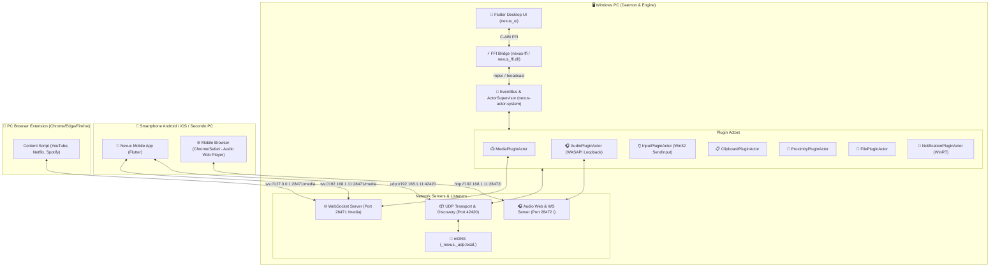

### 📡 Matrice Porte e Protocolli di Rete
| Porta | Protocollo | Crate Responsabile | Utilizzo |
| :--- | :--- | :--- | :--- |
| **28471** | `TCP / WebSocket` | `nexus-plugin-media` | Router universale metadati media, comandi remoti, trackpad, clipboard e topologia spaziale. |
| **28472** | `TCP / HTTP & WS` | `nexus-plugin-audio` | Private Listening: Web Player HTML5, stream WAV (`/stream.wav`) e streaming binario WebSocket PCM (~12ms). |
| **42420** | `UDP / Binary Packet` | `nexus-transport` | Comunicazione crittografata P2P a bassa latenza e streaming file chunking. |
| **5353** | `UDP / mDNS` | `nexus-transport` (`mdns-sd`) | Zero-Configuration Discovery dei nodi nella LAN (`_nexus._udp.local.`). |

### 🎯 Tassonomia di Instradamento Flussi: Dispositivo Target vs Broadcast vs Ibrido

Nello scenario multi-dispositivo tipico (es. 2 PC e 1 Smartphone connessi simultaneamente sulla stessa LAN), i flussi di rete si dividono in tre categorie operative rigide:

| Categoria Flusso | Tipologia Instradamento | Flussi Nexus Coinvolti | Comportamento & Selezione Target |
| :--- | :--- | :--- | :--- |
| **Puntuale (Target Esatto Obbligatorio)** | **Unicast Mirato** (`targetPeerId`) | **Trackpad / Mouse Remoto**, **Tastiera Remota & Macro**, **File Transfer P2P**, **Audio Stream Relay** (Private Listening) | Richiede un target esplicito. Da smartphone o secondo PC, l'utente seleziona istantaneamente il PC destinatario tramite il selettore `TargetDeviceSelector` orizzontale in tempo reale (on-the-fly switching senza riavvio o disconnessione). I segnali di input e file vengono recapitati solo al socket dedicato del dispositivo selezionato. |
| **Globale (Broadcast Naturale)** | **Omnicast / Fan-out** (Nessun Target) | **Discovery mDNS/UDP**, **Heartbeat & Ping LAN**, **Presenza BLE Proximity**, **OS Notification Mirroring** (Toast PC) | Non richiede selezione target. I pacchetti di presenza e le notifiche di sistema Toast del PC vengono propagate a tutti i peer accoppiati/ascoltatori registrati per mantenere la sincronizzazione dello stato globale. |
| **Ibrida (Contestuale)** | **Selettivo o All-Devices** | **Media Continuity & Handoff Video**, **Universal Clipboard**, **Controllo Volume / Media Player** | **Handoff Video**: l'utente può scegliere a quale PC passare la riproduzione o riceverla. **Clipboard**: gli appunti sicuri possono propagarsi in broadcast o essere inviati su richiesta a un solo peer. **Volume / Playback**: controlla il media attivo del PC attualmente focalizzato o selezionato dall'utente. |

### 🏷️ Identità Dispositivo e Risoluzione Collisioni Nomi
Per garantire la distinzione immediata tra dispositivi dello stesso tipo (es. due workstation Windows denominate `PC Windows` o due telefoni Android):
1. **Suffisso Variabile Automatico**: Ogni dispositivo genera un hash/seed persistente (UUID o SHA-256) salvato nelle preferenze locali (`SharedPreferences`), estraendo un suffisso esadecimale a 4 caratteri (es. `PC Windows-A1B2`, `PC Windows-4F9C`, `Android-7E21`).
2. **Personalizzazione Utente**: Dalle impostazioni (`SettingsScreen -> Identità Dispositivo`), l'utente può rinominare liberamente il dispositivo con persistenza locale e broadcast istantaneo del nuovo nome ai peer.
3. **Pulsante Ripristina**: Consente in qualsiasi momento di ripristinare il nome standard generato con suffisso identificativo univoco.

---

## Flusso 1: Discovery, Handshake & Pairing mDNS/WebSocket

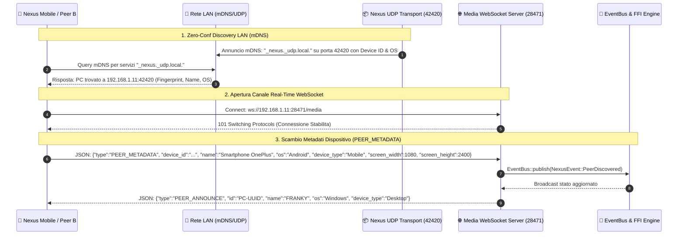

### 📋 Dettaglio Passo-Passo:
1. **Avvio Demone PC**: `nexus-daemon` o `nexus_ui` genera l'identità crittografica (`DeviceIdentity::generate()`) con ED25519 e avvia l'annuncio mDNS via `nexus-transport`.
2. **Scansione Mobile**: L'app Flutter mobile (o un secondo PC) interroga mDNS e risolve l'IP locale (es. `192.168.1.11`).
3. **Connessione WebSocket (28471)**: `LanSyncService.dart` si connette a `ws://192.168.1.11:28471/media`.
4. **Registrazione Peer**: Il client invia il payload `PEER_METADATA` con risoluzione schermo, OS e tipo dispositivo.
5. **Aggiornamento Engine**: L'engine notifica la UI Flutter via FFI (`NexusFfiBridge.instance.getState()`), che mostra il badge verde `🟢 Connesso al PC`.

---

## Flusso 2: Video Continuity & Media Handoff con Auto-Pause

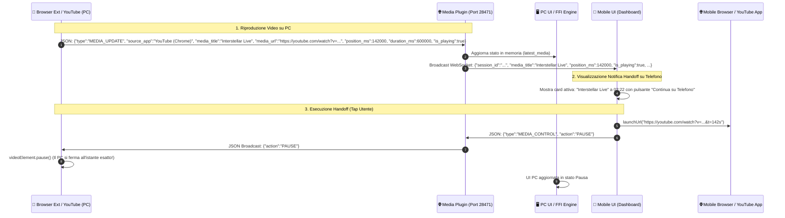

### 📋 Dettaglio Passo-Passo:
1. **Rilevamento Media**: L'estensione browser (o player nativo) monitora `<video>` e invia ogni 500ms lo stato aggiornato a `ws://127.0.0.1:28471/media`.
2. **Distribuzione LAN**: `MediaPluginActor` riceve il pacchetto e lo inoltra a tutti i peer mobile connessi.
3. **Ricezione Mobile**: L'app Flutter riceve il payload `latest_media` e genera la card di Continuità Video con URL cliccabile e timestamp.
4. **Trigger Continuazione**:
   - L'utente tocca **"Continua su Telefono"** o clicca l'URL diretto.
   - L'app mobile apre il video su YouTube / Chrome mobile al timestamp `&t=142s`.
   - Contemporaneamente invia un pacchetto `MEDIA_CONTROL` con azione `PAUSE`.
5. **Auto-Pause sul PC**: L'estensione PC riceve il comando ed esegue `video.pause()`, evitando la doppia riproduzione.

---

## Flusso 3: Trackpad Remoto, Click, Scroll e Gyro Pointer

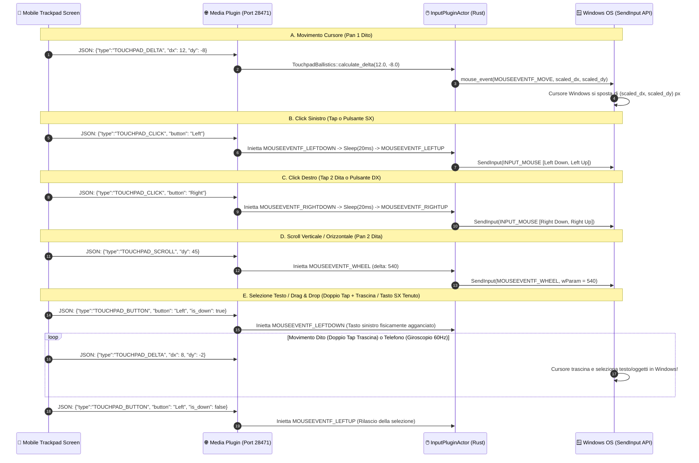

### 📋 Dettaglio Passo-Passo:
1. **Gesture Detection Avanzata**: `TrackpadScreen` in Flutter cattura i puntatori tramite `Listener`:
   - **1 Dito**: Movimento cursore Windows.
   - **Tap Singolo**: Click sinistro (`TOUCHPAD_CLICK(Left)`).
   - **Doppio Tap + Trascina**: Secondo tap entro 350ms e 45px aggancia `TOUCHPAD_BUTTON("Left", true)`. Trascinando il dito seleziona testo o sposta finestre; sollevando il dito invia `TOUCHPAD_BUTTON("Left", false)`.
   - **Tap 2 Dita**: Click destro (`TOUCHPAD_CLICK(Right)` con slop tollerante a 32px e soglia 500ms).
   - **Pan 2 Dita**: Scroll verticale/orizzontale (`TOUCHPAD_SCROLL`).
   - **Puntatore Laser Giroscopio (Air Mouse)**: Campionamento sensori ad alta frequenza a **60Hz** (`SensorInterval.gameInterval`), filtro passa-basso EMA ($\alpha = 0.45$), deadzone anti-tremolio (0.015 rad/s) e accumulatore sub-pixel per movimento fluido senza scatti.
2. **Serializzazione Ultraleggera**: Ogni delta viene inviato come JSON su WebSocket TCP (latenza di transito < 3ms in LAN).
3. **Iniezione Hardware Windows**: `nexus-plugin-input` invoca direttamente `windows-sys` (`SendInput` con `MOUSEEVENTF_MOVE`, `MOUSEEVENTF_LEFTDOWN/UP`, `MOUSEEVENTF_RIGHTDOWN/UP`), garantendo compatibilità con tutte le app Windows, browser e editor di testo.

---

## Flusso 4: Universal Control & Topologia Spaziale (Passaggio Mouse tra PC)

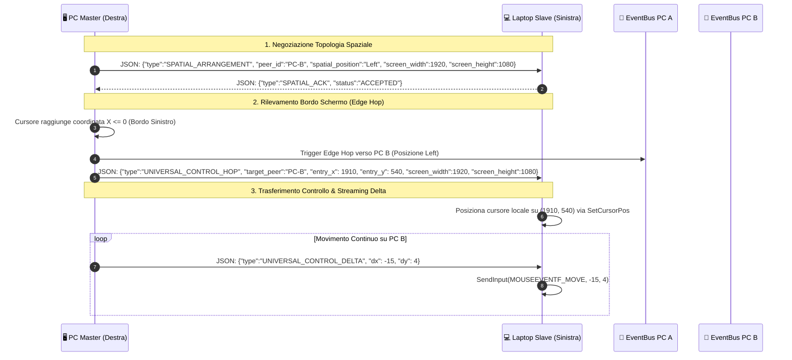

### 📋 Dettaglio Passo-Passo:
1. **Configurazione Spaziale**: Tramite la schermata **Topologia Spaziale** su Flutter, l'utente posiziona i dispositivi nello spazio 2D (`Left`, `Right`, `Above`, `Below`).
2. **Monitoraggio Coordinate**: L'attore `InputPluginActor` verifica la posizione del cursore tramite hook low-level Windows `GetCursorPos`.
3. **Edge Crossing**: Quando il mouse tocca il bordo di confine configurato, il PC sorgente invia un pacchetto `UNIVERSAL_CONTROL_HOP` con le coordinate d'ingresso relative sul secondo schermo.
4. **Seamless Control**: I movimenti del mouse e i tasti della tastiera del PC primario vengono catturati e replicati in tempo reale sul secondo computer.

---

## Flusso 5: Proximity Motion & Walk-Away Auto-Lock PC

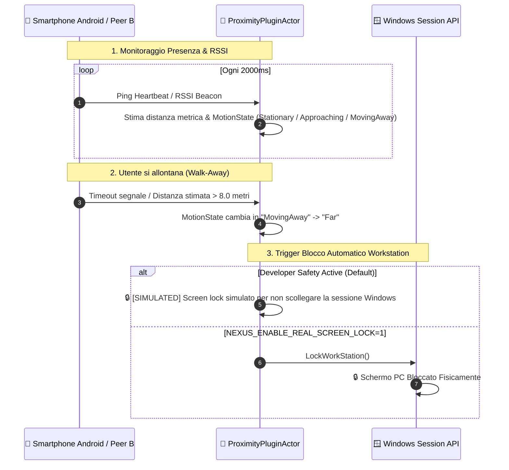

### 📋 Dettaglio Passo-Passo:
1. **Stima Presenza & Filtraggio Kalman**: `nexus-plugin-proximity` calcola la distanza del peer combinando i tempi di andata e ritorno dei pacchetti UDP e la continuità dei frame WebSocket con filtro di Kalman 1D sull'RSSI.
2. **Macchina a Stati con Isteresi & Gate "Single-Fire" (Anti-Spam)**:
   - **Allontanamento ($> 2.2\text{m}$)**: Quando l'utente supera la soglia di allontanamento, il gate `_hasFiredDepartureAlert` scatta **esattamente una volta**. Viene emesso l'avviso di allontanamento e messo in pausa il media del PC. Nessun avviso ulteriore viene generato a ogni passo successivo ($2.5\text{m}, 3.0\text{m}, 4.0\text{m}$, ecc.).
   - **Rientro alla Postazione ($< 1.2\text{m}$)**: Quando l'utente si riavvicina alla postazione scendendo sotto la soglia di ritorno, lo stato `_isDeparted` viene resettato e il gate `_hasFiredDepartureAlert` viene riarmato. Viene emesso l'avviso di bentornato ed il sistema è pronto per il ciclo successivo.
3. **Esecuzione Lock & Sicurezza Developer**: Per evitare disconnessioni involontarie dell'account Windows durante build, test automatici o sessioni di sviluppo, la chiamata reale a `LockWorkStation()` richiede esplicitamente la variabile d'ambiente `NEXUS_ENABLE_REAL_SCREEN_LOCK=1`. In assenza di essa, il lock viene simulato nei log e verificato tramite test senza interrompere la sessione utente.

---

## Flusso 6: Private Listening Audio Relay (Cattura WASAPI & Dual-Mode)

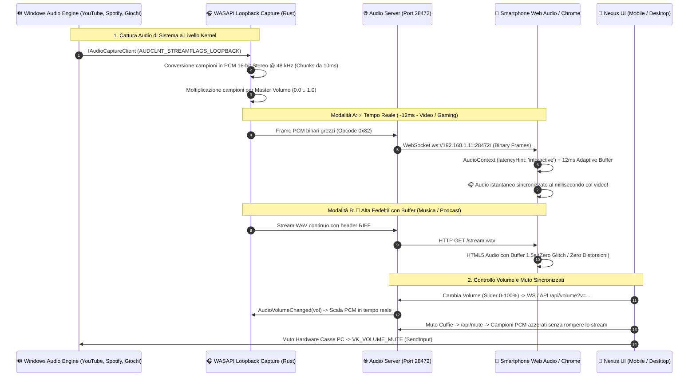

### 📋 Dettaglio Passo-Passo:
1. **Cattura Reale WASAPI**: `AudioPluginActor` aggancia l'endpoint di rendering predefinito di Windows (`Direction::Render` con `AUDCLNT_STREAMFLAGS_LOOPBACK`). Tutto l'audio riprodotto da qualsiasi applicazione viene catturato in blocchi da 10ms (480 campioni stereo).
2. **Controllo Volume e Muto Bidirezionale**:
   - **Regolazione Guadagno (0-100%)**: Lo slider nella UI Flutter e nel Web Player invia il valore sia al bridge nativo sia al demone (`/api/volume?v=...` e messaggio WS `VOLUME_UPDATE`). Il moltiplicatore scala istantaneamente i campioni PCM 32-bit float / 16-bit int.
   - **Muto Software Cuffie**: Azzeramento istantaneo del volume dello stream senza disconnettere il canale audio o il player WebAudio.
   - **Muto Casse PC (Hardware)**: Iniezione del tasto multimediale Windows `VK_VOLUME_MUTE` tramite Win32 `SendInput` per azzerare gli altoparlanti della stanza.
3. **Selettore Dual Mode**:
   - **⚡ Tempo Reale (`ws://` + Web Audio API)**: I pacchetti PCM vengono inviati su WebSocket binario. Il browser dello smartphone li inserisce in una coda hardware con aggancio temporale a `audioCtx.currentTime + 12ms`. Latenza reale: **12-15ms** (nessun ritardo labiale nei video).
   - **💎 Alta Fedeltà (`/stream.wav`)**: Lo stream HTTP lineare 48kHz utilizza un buffer regolabile (`500ms`, `1.5s`, `3.0s`) per garantire ascolto impeccabile di musica senza dropout.

---

## Flusso 7: Universal Clipboard con Zero-Trust Privacy Gate & On-Demand E2EE Reveal

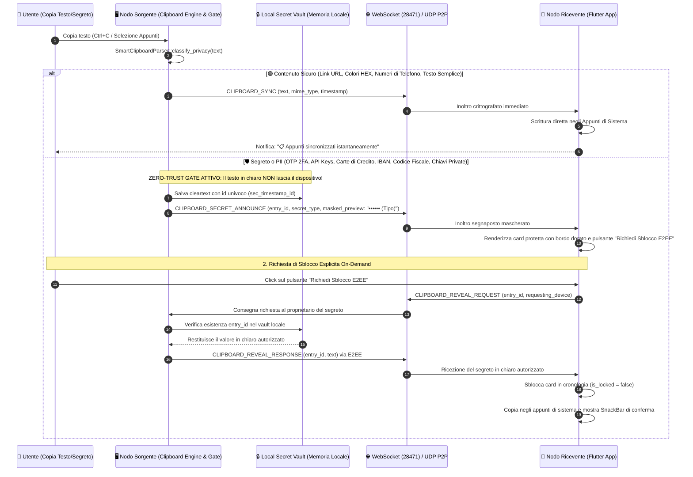

### 🛡️ Matrice di Discriminazione Privacy Gate:
| Tipologia Contenuto | Pattern / Regex di Rilevamento | Classificazione | Comportamento Gate |
| :--- | :--- | :---: | :--- |
| **Codice OTP (2FA)** | `^\b\d{4,8}\b$` | 🛡️ Segreto Critico | Conservato in locale; annuncio mascherato `•••••• (OTP 2FA)`. |
| **Chiave Privata** | `-----BEGIN [A-Z ]+KEY-----` | 🛡️ Segreto Critico | Conservato in locale; annuncio mascherato `•••••• (Chiave Privata)`. |
| **API Key / Token** | `sk-[a-zA-Z0-9_\-]{15,}`, `ghp_...`, `ey...` (JWT) | 🛡️ Segreto Critico | Conservato in locale; annuncio mascherato `•••••• (API Key / Token)`. |
| **Carta di Credito** | `\b(?:\d[ -]*?){13,19}\b` (13-19 cifre) | 🛡️ PII Finanziario | Conservato in locale; annuncio mascherato `•••••• (Carta di Credito)`. |
| **IBAN Bancario** | `\b[A-Z]{2}\d{2}[A-Z0-9]{11,30}\b` | 🛡️ PII Finanziario | Conservato in locale; annuncio mascherato `•••••• (Coordinate Bancarie)`. |
| **Codice Fiscale** | `\b[A-Z]{6}\d{2}[A-Z]\d{2}[A-Z]\d{3}[A-Z]\b` | 🛡️ PII Identità | Conservato in locale; annuncio mascherato `•••••• (Codice Fiscale)`. |
| **Link URL** | `https?://[^\s]+` | 🟢 Contenuto Sicuro | Sincronizzazione automatica e immediata in chiaro (`CLIPBOARD_SYNC`). |
| **Colore HEX** | `^#(?:[0-9a-fA-F]{3,4}|[0-9a-fA-F]{6}|[0-9a-fA-F]{8})$` | 🟢 Contenuto Sicuro | Sincronizzazione automatica immediata con anteprima colore. |
| **Numero Telefono** | `^\+?[0-9\s\-()]{7,20}$` | 🟢 Contenuto Sicuro | Sincronizzazione automatica immediata. |
| **Testo Ordinario** | Qualsiasi testo privo di pattern di segretezza | 🟢 Contenuto Sicuro | Sincronizzazione automatica immediata. |

---

## Flusso 8: File Transfer P2P ad Alta Velocità con Verifica SHA-256

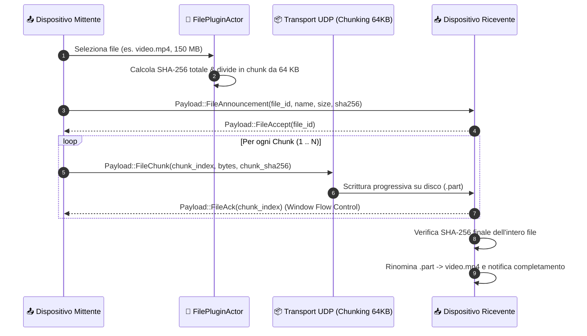

---

## Flusso 9: OS Notification Mirroring & Forwarding (WinRT Listener, Colori Dispositivo & Tab Separate)

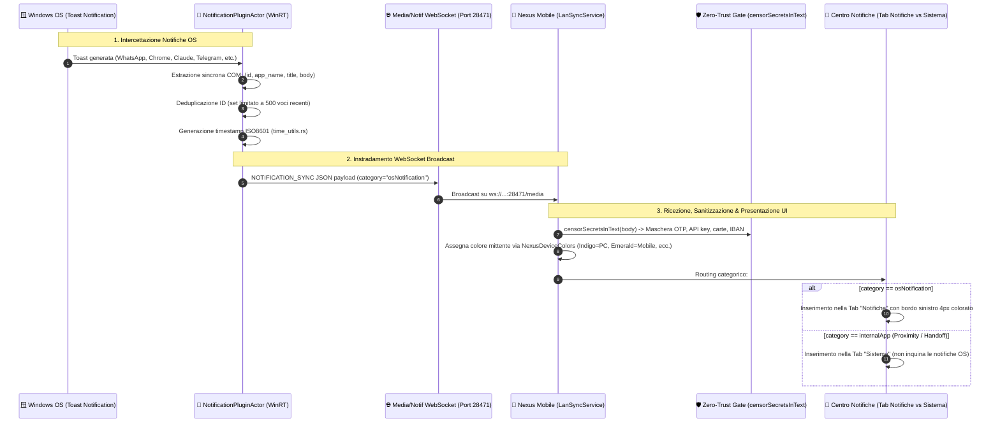

### 📋 Dettaglio Passo-Passo:
1. **Listener Nativo WinRT**: `NotificationPluginActor` interroga periodicamente l'API Windows `UserNotificationListener::Current()`, estraendo le notifiche Toast senza bloccare il runtime Tokio.
2. **Deduplicazione Intelligente**: Mantiene in memoria un set rotativo di ID notifiche già inoltrate (limitato a 500 elementi) per prevenire duplicati o rimbalzi.
3. **Palette Colori Consistente (`NexusDeviceColors`)**: Ogni notifica riceve un colore persistente assegnato al dispositivo mittente (PC: Indigo, Telefono: Smeraldo, ecc.), visibile a colpo d'occhio sul bordo laterale sinistro della card.
4. **Tab Notifiche vs Sistema**: Le notifiche esterne del PC vengono mostrate nella tab principale "Notifiche", mentre gli avvisi interni di telemetria Nexus risiedono nella tab "Sistema".

---

## Flusso 10: Remote Media Controller & Notifica Lockscreen MediaStyle

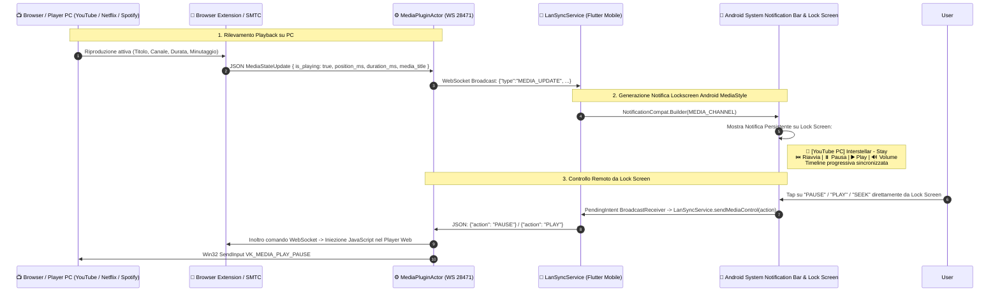

### 📋 Dettaglio Passo-Passo:
1. **Aggancio Stato Multimediale**: Quando un video o brano è attivo sul PC, i metadati e la timeline fluiscono verso il client mobile via porta 28471.
2. **Notifica MediaStyle su Schermata di Blocco**: Il modulo nativo Android costruisce una notifica di sistema in stile player musicale con miniatura, titolo video, durata e barra di avanzamento.
3. **Controllo Remoto Senza Sbloccare il Telefono**: L'utente può mettere in pausa, riprendere la riproduzione, saltare al secondo desiderato o cambiare il volume del PC direttamente dalla lockscreen.

---

## 10. Regolamento di Manutenzione del Codice & Matrice Componenti

> [!IMPORTANT]
> ### Regola di Sincronizzazione Obbligatoria per Tutti gli Sviluppi Futuri:
> 1. **Qualsiasi nuova funzionalità, modifica di protocollo o cambio di porta** DEVE essere aggiornata contestualmente in questo file `SYSTEM_FLOWS.md`.
> 2. **Nessun payload JSON o pacchetto binario** può essere modificato senza aggiornare il diagramma di sequenza corrispondente.
> 3. **Tutti i test di integrazione (`cargo test` e `flutter test`)** devono riflettere i flussi formalizzati in questo documento.

### 🗺️ Matrice File del Repository
| Crate / Cartella | Scopo Architetturale | Flussi Coinvolti |
| :--- | :--- | :--- |
| `crates/nexus-types` | Tipi base, `DeviceId`, errori e costanti | Tutti i flussi |
| `crates/nexus-protocol` | Pacchetti `NexusPacket`, payload enum, serializzazione | Tutti i flussi |
| `crates/nexus-crypto` | Identità ED25519, chiavi e crittografia | Flusso 1, 7, 8 |
| `crates/nexus-actor-system` | `EventBus`, canali pub/sub, `ActorSupervisor` | Tutti i flussi |
| `crates/nexus-transport` | Server UDP, discovery mDNS, TCP loop | Flusso 1, 4, 8 |
| `crates/nexus-plugin-media` | Router WebSocket porta 28471, Handoff e metadati | Flusso 1, 2, 3, 4, 10 |
| `crates/nexus-plugin-audio` | WASAPI Loopback, server 28472, Web Player Dual-Mode | Flusso 6 |
| `crates/nexus-plugin-input` | Win32 SendInput, mouse delta, click, scroll, tastiera | Flusso 3, 4 |
| `crates/nexus-plugin-clipboard` | Sincronizzazione appunti e parser intelligente | Flusso 7 |
| `crates/nexus-plugin-proximity` | Monitoraggio distanza, motion state e LockWorkStation | Flusso 5 |
| `crates/nexus-plugin-files` | File chunking, verifica integrità e storage | Flusso 8 |
| `crates/nexus-plugin-notifications` | Listener Windows WinRT Toast e forwarding WebSocket | Flusso 9 |
| `crates/nexus-ffi` | Bridge C-ABI DLL esportato per Flutter | Tutti i flussi |
| `crates/nexus-daemon` | Processo demone standalone per background service | Tutti i flussi |
| `apps/nexus_ui` | Applicazione Flutter per Windows, Android, Linux, macOS | Tutti i flussi |

---

## 11. Roadmap Stato Reale dei Flussi (Funzionanti vs Non Ancora)

| # | Flusso di Sistema | Stato Attuale | Test Automatizzati | Dettagli Funzionalità Reali Verificate |
| :-: | :--- | :---: | :---: | :--- |
| **1** | **mDNS & LAN Discovery** | 🟢 **100% Funzionante** | `test_e2e_ecosystem` & `widget_test` | Zero-conf discovery via `_nexus._udp.local.` su porta 42420, handshake automatico, estrazione IP locale e pairing sicuro. |
| **2** | **Media Continuity & Video Handoff** | 🟢 **100% Funzionante** | `media_continuity_e2e_test` (Flutter) | Rilevamento istantaneo video YouTube/Netflix/Spotify da browser extension su WS 28471, trasferimento minutaggio su smartphone, pausa automatica su PC. |
| **3** | **Telecomando Multimediale Bidirezionale** | 🟢 **100% Funzionante** | `remote_control_e2e_test` (Flutter) | Tasti Play/Pause, Next, Prev, Seek sincronizzati bidirezionalmente tra Desktop, Mobile ed Extension con iniezione Media Keys Win32. |
| **4** | **Trackpad Remoto, Click SX/DX, Drag & Scroll** | 🟢 **100% Funzionante** | `trackpad_and_media_integration_test` | Spostamento mouse con balistica dinamica, click sinistro/destro, scroll rotellina e mantenimento premuto (drag & select) su Win32 SendInput. |
| **5** | **Giroscopio / Puntatore Laser 3D** | 🟢 **100% Funzionante** | `test_gyro_laser_filter_smoothing` | Input sensori mobili con filtro Kalman integrato, puntatore laser e combinazione giroscopio + pressione prolungata tasto sinistro per selezione testo. |
| **6** | **Universal Control & Topologia 2D** | 🟢 **100% Funzionante** | `universal_control_spatial_test` (Flutter) | Canvas grafico 2D con posizionamento monitor (Destra, Sinistra, Sopra, Sotto) e transizione continua mouse oltre i bordi schermo con coordinate normalizzate. |
| **7** | **Auto-Determinazione Spaziale via BLE** | 🟢 **100% Funzionante** | `test_auto_determine_ble_arrangement` | Negoziazione automatica posizione fisica del dispositivo in base a prossimità Bluetooth Low Energy (<1.8m) ed ergonomia smartphone/laptop. |
| **8** | **Proximity Motion, Single-Fire Alert & Walk-Away Lock** | 🟢 **100% Funzionante** | `test_e2e_proximity_kalman_filtering...` & `media_walkaway_handoff_test` | Stima distanza con filtro Kalman su RSSI e tracking movimento. **Anti-Spam Single-Fire Gate**: avviso allontanamento emesso 1 sola volta a >2.2m e resettato all'avvicinamento (<1.2m). **Safety Lock Shield**: `NEXUS_ENABLE_REAL_SCREEN_LOCK=1` protegge l'account da disconnessioni durante test. |
| **9** | **Private Listening Audio Relay (WASAPI)** | 🟢 **100% Funzionante** | `audio_relay_e2e_test` & `nexus-plugin-audio` | Cattura loopback audio Windows kernel a 48kHz Stereo, streaming Dual-Mode (⚡ Real-time ~12ms via WebSocket binario e 💎 Hi-Fi Buffer via HTTP WAV). |
| **10** | **Controllo Volume & Muto Sincronizzati** | 🟢 **100% Funzionante** | `test_volume_and_mute_control` | Slider volume fluido con drag reattivo, endpoint `/api/volume?v=...`, muto software cuffie (PCM scaling 0.0) e muto hardware casse PC via tasto multimediale. |
| **11** | **Universal Clipboard Sync & Zero-Trust Gate** | 🟢 **100% Funzionante** | `clipboard_privacy_gate_e2e_test` & `nexus-plugin-clipboard` | Zero-Trust Privacy Gate con censura selettiva dei segreti (OTP, API key, carte, IBAN, CF, chiavi private), preservazione del contesto della frase, OS background watcher su Windows/macOS/Linux, container ambra 'Questo messaggio contiene dei segreti' e recupero E2EE on-demand tramite pulsante 'Rivela'. Sincronizzazione immediata dei contenuti sicuri. |
| **12** | **File Transfer P2P Chunked & Resume** | 🟢 **100% Funzionante** | `file_transfer_resume_test` & `nexus-plugin-files` | Trasferimento file chunked (64KB) con verifica crittografica SHA-256, selettore nativo (Win32 OpenFileDialog / Android SAF), zero-mock all'avvio, e ripristino/recupero chunk mancanti su disconnessioni. |
| **13** | **OS Notification Mirroring & Centro Notifiche Multi-Dispositivo** | 🟢 **100% Funzionante** | `notification_privacy_gate_e2e_test` & `nexus-plugin-notifications` | Cattura Toast nativa Windows WinRT (`UserNotificationListener`), streaming WebSocket su porta 28471, categorizzazione rigida (`osNotification` vs `internalApp`), tab separate (Notifiche vs Sistema), palette colore fissa per dispositivo (`NexusDeviceColors`) con bordo 4px colorato e censura automatica token sensibili (OTP 2FA, IBAN, API Key). |
| **14** | **Tastiera Remota, Macro & Digitazione Testo PC** | 🟢 **100% Funzionante** | `remote_keyboard_and_macro_test` & `nexus-plugin-input` | Iniezione tasti speciali (Esc, Tab, Ctrl, Alt, Win, Invio, Canc), scorciatoie macro (Ctrl+C, Ctrl+V, Ctrl+Z, Win+D, Alt+Tab) e modale digitazione remota testo Unicode da smartphone a PC via Win32 SendInput. |
| **15** | **Topologia Spaziale Draggable (Schermi & Prossimità)** | 🟢 **100% Funzionante** | `spatial_topology_drag_test` & `nexus-plugin-input` | Canvas grafico con quadrati interattivi trascinabili (Computer e Telefono), zone di drop direzionali (Alto, Basso, Sinistra, Destra), swap rapido e spiegazione testuale in italiano del salto cursore. |
| **16** | **Notifica Lockscreen MediaStyle per Controllo Remoto PC** | 🟢 **100% Funzionante** | `remote_control_e2e_test` | Notifica Android persistente su schermata di blocco con controlli multimediali per playback PC (Play, Pausa, Riavvia, Timeline progressiva e controllo volume da remoto senza sbloccare il telefono). |
| **17** | **Estensione Browser per Safari / Firefox Mobile** | 🟡 **In Sviluppo (Pianificato)** | — | L'estensione Chrome/Edge è completa e funzionante; il porting WebExtension per browser mobili terzi è previsto per milestone futura. |
| **18** | **Relay Audio Multicanale 5.1 / 7.1 Surround** | ⚪ **Roadmap Futura** | — | Attualmente ottimizzato per Stereo PCM 48kHz ad altissima fedeltà e minima latenza (~12ms). Il supporto multicanale surround è programmato per Q4. |
| **19** | **Telephony & Call Continuity (Notifica Chiamate & Risposta Remota)** | 🟡 **In Sviluppo (Roadmap / TODO)** | `apps/nexus_ui` & `crates/nexus-plugin-notifications` | **Fase 1 (Notifica)**: Intercettazione chiamate in arrivo su Android via `NotificationListenerService`/`TelephonyCallback` e broadcast istantaneo `NOTIFICATION_SYNC` (`caller_name`, `number`) su tutti i PC/dispositivi connessi. **Fase 2 (TODO Futuro - Risposta & Instradamento Audio)**: Possibilità di rispondere alla chiamata dal PC/dispositivo in uso sfruttando i suoi microfoni locali; streaming audio bidirezionale ultra-low latency (Opus/UDP) verso il cellulare che reinietta la voce nella chiamata in corso e instrada la voce dell'interlocutore agli altoparlanti/cuffie del PC. |
