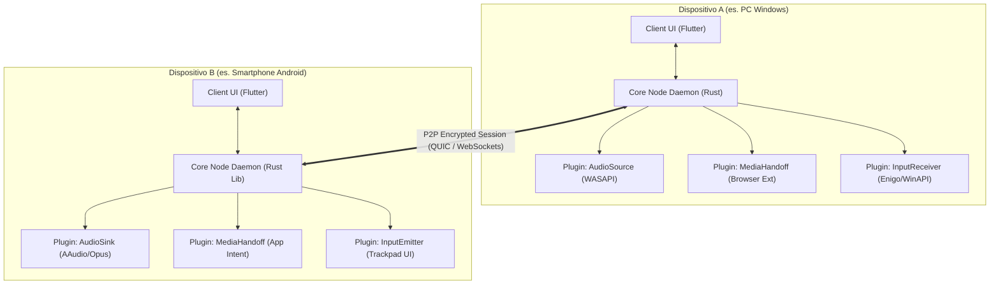

# 02. Architettura a Micro-Plugin & Capability Engine

## 🏛️ Filosofia Architetturale: "Capability-Driven Topology"

Il sistema non classifica i dispositivi in "Master" o "Slave", né in "Server" o "Client". **Ogni dispositivo connesso è un "Nodo Autonomo" (Peer)** che espone un set dinamico di **Capacità (*Capabilities*)**.



---

## 🧩 Il Modello a Plugin (Capability Provider)

Un plugin è un'unità autonoma di logica specializzata. Non sa e non si cura di quale dispositivo remoto stia invocando il servizio: si limita a implementare un'interfaccia standard (`CapabilityTrait`).

### Definizione di una Capacità (Rust Interface)
```rust
#[async_trait]
pub trait CapabilityProvider: Send + Sync {
    /// Identificativo univoco della capacità (es. "media.handoff", "audio.relay")
    fn capability_id(&self) -> &'static str;

    /// Versione del protocollo del plugin
    fn version(&self) -> SemVer;

    /// Notifica quando un nuovo nodo remoto con capacità compatibile entra nella rete
    async fn on_peer_discovered(&self, peer: &PeerContext);

    /// Ricezione di un messaggio/richiesta RPC destinato a questo plugin
    async fn handle_rpc(&self, ctx: &RpcContext, payload: &[u8]) -> Result<Vec<u8>, PluginError>;

    /// Pulizia delle risorse quando il peer si disconnette
    async fn on_peer_disconnected(&self, peer_id: &PeerId);
}
```

---

## 🔄 Separazione Tra Daemon di Background e UI

Uno dei motivi per cui le app di continuità falliscono o consumano troppa batteria è l'accoppiamento stretto tra interfaccia grafica e networking.

Nel nostro sistema:
1. **Core Daemon (Headless Background Service)**:
   - Scritto in **Rust**.
   - Avviato all'avvio del sistema (Windows Service / systemd su Linux / LaunchAgent su macOS / Foreground Service su Android).
   - Occupa < 15 MB di RAM e 0% di CPU in idle.
   - Gestisce la crittografia, i socket di rete, mDNS, BLE e la cattura/simulazione a basso livello (Audio, Mouse, Tastiera).
2. **Client UI (Interfaccia Grafica)**:
   - Scritta in **Flutter**.
   - Può essere chiusa in qualsiasi momento: il daemon continua a gestire la continuità (es. clipboard, notifiche, handoff) in background.
   - Quando la UI viene aperta, si connette al Daemon locale tramite **IPC (Inter-Process Communication)** ad altissima velocità:
     - **Windows/Linux/macOS**: Named Pipes o Unix Domain Sockets (`/var/run/nexus.sock` o `\\.\pipe\nexus`).
     - **Android/iOS**: FFI diretto (la libreria Rust gira nello stesso processo del frontend o all'interno del Foreground Service).

---

## 📡 Tabella delle Capacità (*Capabilities Map*)

All'atto del pairing o dell'handshake di rete, due nodi si scambiano la loro **Capability Map**:

| Capability ID | Ruolo Emettitore (Source) | Ruolo Ricevitore (Sink) | Descrizione |
| :--- | :--- | :--- | :--- |
| `media.handoff` | Browser / Desktop Player | Mobile / Browser | Trasferisce URL + timestamp di riproduzione video/audio. |
| `audio.relay` | Mixer OS (WASAPI/PipeWire) | Cuffie / Speaker | Cattura audio a livello kernel e lo invia via stream compresso Opus. |
| `input.control` | Touchscreen / Gyro | Kernel Input Subsystem | Invia comandi di mouse, coordinate assolute/relative, tasti e gesti. |
| `clipboard.sync` | OS Clipboard Listener | OS Clipboard Setter | Sincronizza testo, formati ricchi e immagini con crittografia E2E. |
| `file.stream` | File System Locale | File Downloader / Player | Consente download chunked o streaming diretto senza upload preventivo. |
| `camera.bridge` | Fotocamera Smartphone | Virtual Webcam Driver (v4l2/DirectShow) | Trasforma lo smartphone in una webcam 4K a zero ritardo. |
| `proximity.tracker` | BLE Beacon / RSSI Monitor | Power & Session Manager | Traccia la distanza fisica per auto-lock o trigger di notifica. |

---

## 🛡️ Isolamento e Sicurezza dei Plugin

Ogni plugin opera all'interno di una sandbox logica con permessi espliciti:
* **Permessi per Device**: L'utente può consentire la condivisione appunti con il proprio telefono, ma disabilitarla per il PC aziendale.
* **Permessi per Plugin**: Un plugin compromesso non può accedere ai buffer audio se ha registrato solo capacità di input.
