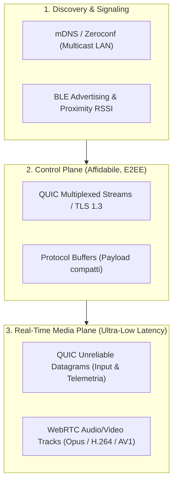

# 03. Analisi Approfondita dello Stack Tecnologico

Per realizzare un ecosistema universale (Windows, macOS, Linux, Android, iOS) reattivo, stabile e con consumo di risorse quasi nullo in background, la scelta dello stack è fondamentale. Di seguito l'analisi comparativa dettagliata.

---

## ⚙️ 1. Core Daemon (Background Engine)

Il core deve gestire:
- Sockets ad alta velocità (QUIC, UDP, TCP)
- Crittografia asimmetrica a bassa latenza
- Accesso alle API native dell'OS (Audio Loopback, Mouse/Keyboard virtuale, Bluetooth Low Energy, Clipboard, Battery, Window APIs)
- Esecuzione continua in background con footprint minimo di RAM e CPU

### Comparativa:

| Criterio | **Rust (Scelta Consigliata)** | **Go** | **C++20** | **Node.js / Electron** |
| :--- | :--- | :--- | :--- | :--- |
| **Consumo RAM (Idle)** | **< 12 MB** | 30 - 50 MB | < 15 MB | 150 - 300 MB |
| **Garbage Collector** | **Nessuno (Zero-cost abstractions)** | Sì (pause GC imprevedibili sull'audio) | Nessuno | Sì |
| **Sicurezza Memoria** | **100% Memory-Safe (Borrow Checker)** | Memory-safe | Rischio Memory Leaks / Segfaults | Memory-safe |
| **Binding C/OS (FFI)** | **Eccellente (Zero-overhead)** | CGo lento / problematico | Nativo | FFI complesso |
| **Integrazione Mobile** | Compila in `.so` (Android) e `.a` (iOS) | Pesante su iOS | Supportato | Non adatto a background mobile |

> **Decisione**: **RUST** (con runtime asincrono `tokio`).
> **Librerie Chiave Rust**:
> - Networking: `quinn` (QUIC), `tokio-tungstenite` (WebSockets fallback), `webrtc` (P2P real-time)
> - Audio: `cpal` (Cross-Platform Audio Library) + `audiopus_sys` / `opus` encoder/decoder
> - Input: `enigo` / `rdev` / binding diretti `winapi` / `core-graphics` / `uinput`
> - Bluetooth: `btleplug`
> - Crittografia: `snow` (Noise Protocol Framework), `ed25519-dalek`, `chacha20poly1305`

---

## 🎨 2. Interfaccia Utente (Client App)

La UI deve consentire all'utente di:
- Eseguire il pairing (inquadratura QR code, PIN)
- Visualizzare lo stato dei dispositivi connessi, batteria, rete
- Mostrare i pop-up di handoff multimediale
- Fornire il trackpad virtuale, tastiera, telecomando audio
- Gestire le impostazioni e i permessi granulari

### Comparativa:

| Criterio | **Flutter (Scelta Consigliata)** | **Tauri (Rust + Web)** | **React Native** | **Nativo Separato (Swift/Kotlin/C#)** |
| :--- | :--- | :--- | :--- | :--- |
| **Piattaforme Supportate** | **Win, Mac, Linux, Android, iOS** | Win, Mac, Linux (Mobile ancora immaturo) | Android, iOS (Desktop terzo incomodo) | 4-5 codebase separate (manutenzione x5) |
| **Prestazioni Grafiche** | **Motore Impeller / Skia (120 FPS costanti)** | Dipende da WebView di sistema | Bridge JS / Fabric | Massime |
| **Integrazione con Rust Core** | **`flutter_rust_bridge` (Zero-copy FFI)** | Nativo su desktop, difficile su mobile | FFI tramite C++ | FFI separato per ogni OS |
| **Look & Feel Nativo** | Eccellente (Adattivo Material3/Cupertino/Fluent) | Web look | Buon look su mobile | Nativo al 100% |

> **Decisione**: **FLUTTER** per l'interfaccia client unica su tutti e 5 i sistemi operativi, interfacciata al Core Rust tramite `flutter_rust_bridge`.

---

## 🌐 3. Networking, Trasporto & Latenza

Per avere un'interazione migliore di Apple, non possiamo usare solo HTTP o WebSockets standard. Il sistema adotta un modello di trasporto su 3 livelli:

1. **Discovery**: **mDNS (`_nexus._tcp.local`) + BLE Advertising**. I dispositivi si trovano in meno di 200ms sulla rete locale senza toccare server cloud.
2. **Control & State Sync (Control Plane)**: **QUIC Streams (`quinn`) + Protocol Buffers**. Permette lo scambio affidabile di eventi (cambio volume, clipboard, notifiche, avvisi di handoff) senza blocchi *Head-of-Line*.
3. **Audio / Video / Input (Real-time Plane)**:
   - **Input (Mouse/Tastiera)**: Pacchetti UDP/QUIC Datagrams con timestamp (latenza < 5ms in LAN).
   - **Audio Stream**: Codec **Opus** con frame size di 5-10ms e bitrate adattivo (32-128 kbps).
   - **Webcam HD**: H.264 / AV1 via WebRTC hardware-accelerated.

---

## 🧩 4. Estensione Browser (Web Handoff Engine)

Per intercettare YouTube, Netflix, Spotify Web e qualsiasi video HTML5:
* **Framework**: **WXT (Web Extension Framework)** o TypeScript puro con supporto simultaneo a **Manifest V3** (Chrome, Edge, Brave, Opera) e **Manifest V2/V3** (Firefox, Safari).
* **Comunicazione con il Daemon Locale**:
  * Native Messaging (`chrome.runtime.connectNative`) o Local WebSocket protetto su `127.0.0.1:28471` con token effimero scambiato all'avvio.

---

## 📊 Matrice Finale dello Stack

| Componente | Linguaggio / Framework | Librerie / Strumenti |
| :--- | :--- | :--- |
| **Daemon Engine** | Rust (Edition 2021) | `tokio`, `quinn`, `cpal`, `btleplug`, `enigo`, `snow` |
| **Client UI** | Dart / Flutter (3.x+) | `flutter_rust_bridge`, `provider` / `riverpod`, `shadcn_ui` |
| **Serialization** | Protocol Buffers (v3) | `prost` (Rust), `protobuf` (Dart) |
| **Crittografia** | Noise Protocol (XX Pattern) | `snow` (ChaChaPoly1305 + Curve25519 + BLAKE2s) |
| **Browser Add-on** | TypeScript | `wxt`, WebExtensions API |
| **Audio Engine** | C / Rust | `cpal`, `audiopus_sys`, RingBuffers lock-free |
