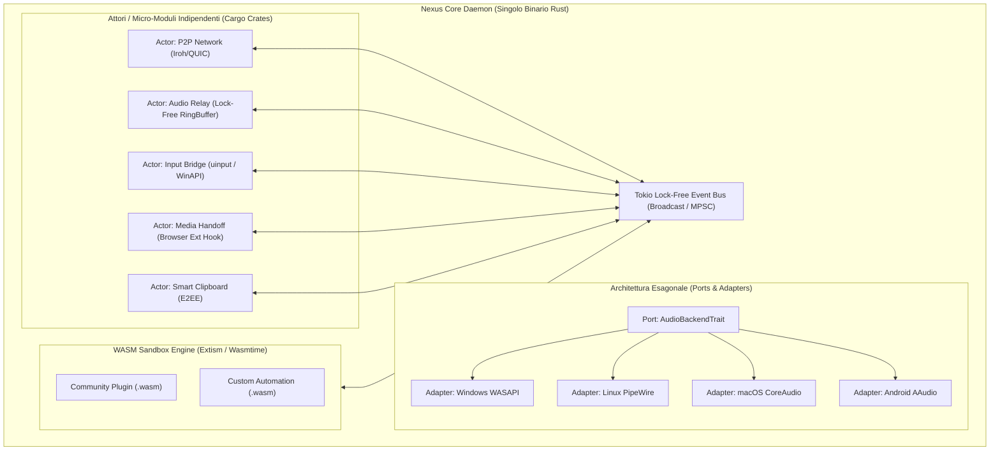

# 05. Valutazione Architetturale: Microservizi vs Monolito Modulare vs Attori

In fase di progettazione di un sistema di continuità per dispositivi eterogenei (Windows, macOS, Linux, Android, iOS), una delle scelte più critiche è: **conviene adottare un'architettura a veri microservizi multi-processo oppure un'altra tipologia di infrastruttura?**

Di seguito l'analisi ingegneristica dettagliata, i trade-off sui vincoli dei sistemi operativi e la raccomandazione architetturale definitiva.

---

## 🔬 1. Confronto tra i Paradigmi Architetturali

```
                      I 3 MODELLI A CONFRONTO
                                 │
     ┌───────────────────────────┼───────────────────────────┐
     ▼                           ▼                           ▼
[1. Microservizi Multi-Proc]  [2. Monolito Modulare / Attori] [3. Ibrido con Sandbox WASM]
 - Processi OS separati       - Singolo binario Rust         - Core & HW Plugin nativi
 - IPC (gRPC/Named Pipes)     - Attori Tokio in-memory       - Community Plugin in WASM
 - Isolamento a livello OS    - Sub-microsecond latency      - Sicurezza e Sandboxing totale
```

### Tabella Comparativa dei Trade-Off:

| Criterio di Valutazione | **1. Microservizi Multi-Processo** | **2. Monolito Modulare (Attori Rust Tokio)** | **3. Ibrido (Attori Rust + Sandbox WASM)** |
| :--- | :--- | :--- | :--- |
| **Latenza Comunicazione Interna** | **2.000 – 6.000 ns** (Overhead IPC + Serializzazione + Context Switch) | **< 50 ns** (Passaggio messaggi in RAM lock-free) | **< 50 ns** (Core) / **~200 ns** (WASM) |
| **Consumo RAM (Idle)** | 60 – 150 MB (N runtime e processi separati) | **< 12 MB** (Singolo runtime ottimizzato) | **< 15 MB** |
| **Compatibilità iOS** | ❌ **Impossibile** (iOS vieta processi multipli/fork/daemon arbitrari) | ✅ **Perfetta** (Compilato in singolo framework `.xcframework`) | ✅ **Perfetta** (Wasmtime embedded) |
| **Compatibilità Android** | ⚠️ **Critica** (Android LMK termina processi multipli in background) | ✅ **Perfetta** (Singolo Foreground Service `.so`) | ✅ **Perfetta** |
| **Isolamento dei Crash** | Totale a livello OS (un processo muore senza intaccare gli altri) | Garantito da Rust (Memory-safety + Tokio `catch_unwind` per riavviare singoli task) | Totale per plugin WASM + Rust safety |
| **Complessità di Distribuzione** | Molto complessa (N eseguibili da installare e gestire nei servizi OS) | **Massima Semplicità** (Un solo binario / un solo file di setup) | **Massima Semplicità** |
| **Estendibilità Terze Parti** | Richiede creazione di nuovi eseguibili demone | Richiede ricompilazione del core | **Chiunque può scrivere plugin in JS/Python/Rust via `.wasm`** |

---

## 🚫 Perché i Microservizi Puri Multi-Processo NON Funzionano su Client & Mobile

Nel mondo Cloud/Server, i microservizi sono ottimi perché scalano su macchine diverse gestite da Kubernetes. Ma su un'applicazione di **continuità tra dispositivi personali (Desktop & Mobile)**, i microservizi multi-processo introducono problemi insormontabili:

1. **Il Muro di iOS (Sandbox a Singolo Processo)**:
   Apple impedisce a qualsiasi app su iOS di eseguire demoni o processi secondari generici. Un'architettura basata su microservizi separati renderebbe impossibile portare l'app su iPhone e iPad.
2. **Il Low Memory Killer di Android (LMK)**:
   Android monitora il numero di processi attivi. Se Nexus avviasse 5 processi diversi per Audio, Media, Input, Clipboard e Rete, il sistema operativo li classificherebbe come ad alto consumo di risorse e li terminerebbe dopo pochi minuti a schermo spento.
3. **Latenza & Risparmio Energetico (CPU Wakeups)**:
   La comunicazione continua via IPC tra processi multipli costringe la CPU a uscire costantemente dai suoi stati di risparmio energetico (*C-states*), riducendo drasticamente la durata della batteria su laptop e smartphone.

---

## 🏆 Il Modello Scelto: "In-Process Modular Monolith con Actor Pattern & Hexagonal Ports"

La soluzione ottimale che combina **la pulizia logica dei microservizi** con **le prestazioni e l'efficienza del singolo binario** è il **Monolito Modulare ad Attori in Rust**.



---

## 🧩 Come Funziona l'Infrastruttura Interna

### 1. Isolamento Modulare a Livello di Codice (Cargo Workspace)
Il repository non è un unico file disordinato, ma è suddiviso in crate Rust completamente disaccoppiate:
* `crates/nexus-core`: Runtime, Event Router, Security & Discovery.
* `crates/nexus-transport`: Gestione connessioni Iroh, QUIC e BLE.
* `crates/nexus-plugin-media`: Logica Handoff e integrazione browser.
* `crates/nexus-plugin-audio`: Cattura loopback e codifica Opus low-latency.
* `crates/nexus-plugin-input`: Simulazione mouse, tastiera e telecomando.
* `crates/nexus-plugin-clipboard`: Sincronizzazione appunti e parser OTP/URL.
* `crates/nexus-wasm-host`: Motore di esecuzione per estensioni esterne.

### 2. Comunicazione ad Attori con Canali Tokio (`tokio::sync`)
Ogni plugin è un attore con la propria coda di messaggi (*Inbox*). La comunicazione avviene senza mutex globali né lock pesanti:
* Invio messaggi in **meno di 50 nanosecondi**.
* Se il plugin Audio invia un frame sonoro o il plugin Input trasmette uno spostamento cursore, il dato passa direttamente tramite puntatori e buffer lock-free in memoria.

### 3. Resilienza e Auto-Guarigione dei Plugin
Se un plugin riscontra un errore o un panic isolato (es. un dispositivo audio Bluetooth viene disconnesso bruscamente), il Core Daemon intercetta l'eccezione tramite `tokio::task::JoinHandle`:
* Il demone **non crasha mai**.
* Il supervisore riavvia automaticamente solo il modulo audio specifico in meno di **10 millisecondi**, ripristinando il servizio in modo del tutto invisibile per l'utente.

### 4. Estendibilità per la Community (WASM Sandbox con Extism)
Per permettere a sviluppatori terzi di creare plugin personalizzati (es. integrazioni per Obsidian, Home Assistant, comandi personalizzati per Stream Deck):
* I plugin di terze parti vengono eseguiti all'interno di una sandbox **WebAssembly (Extism)**.
* Hanno permessi limitati e non possono compromettere la stabilità o la sicurezza del sistema.

---

## 🎯 Verdetto Finale

L'approccio a **Monolito Modulare in-process con Attori Tokio, Architettura Esagonale e Sandbox WASM opzionale** è la scelta tecnicamente perfetta:
* Offre **la massima modularità e pulizia concettuale dei microservizi**.
* Elimina **il 100% dell'overhead di memoria, CPU e latenza IPC**.
* Garantisce la **piena compatibilità nativa su tutte e 5 le piattaforme (Windows, macOS, Linux, Android, iOS)**.
