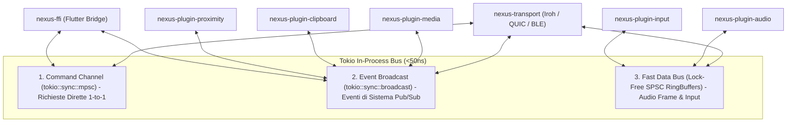

# 06. Moduli, Sottomoduli, Interconnessioni e Flussi Dati

Questo documento definisce in modo esaustivo la scomposizione del sistema in **Crate Rust (Moduli)**, i rispettivi **Sottomoduli**, i **Canali di Interconnessione** e il dettaglio esatto di **Input, Output e Strutture Dati** scambiate per ogni funzionalità.

---

## 🏛️ 1. Mappa dei Moduli del Cargo Workspace

Il Core Daemon è suddiviso in crate isolate e fortemente tipizzate all'interno di un unico **Cargo Workspace**:

```
nexus/
├── Cargo.toml (Workspace Root)
│
├── crates/
│   ├── nexus-types/             <- Tipi condivisi, UUID, DeviceId, Capability, Errori
│   ├── nexus-protocol/          <- Definizioni Protobuf, Serializzazione, Schemi di Rete
│   ├── nexus-crypto/            <- Noise Protocol Framework (XX), Keystore Ed25519, SQLite TrustStore
│   ├── nexus-actor-system/      <- Event Bus Tokio, Supervisione Attori, Canali MPSC / Broadcast
│   ├── nexus-transport/         <- UDP P2P Engine, mDNS Discovery, Multi-Channel Router
│   │
│   ├── nexus-plugin-media/      <- Sottomoduli: session.rs, actor.rs (Auto-Pause, Handoff)
│   ├── nexus-plugin-audio/      <- Sottomoduli: dsp/ (ring, jitter, resampler), capture/ (wasapi), volume/, web/ (player_html), actor.rs
│   ├── nexus-plugin-input/      <- Sottomoduli: ballistics.rs, universal_control.rs, injector.rs, actor.rs
│   ├── nexus-plugin-clipboard/  <- Sottomoduli: parser.rs (OTP/PII/Keys), loop_guard.rs, actor.rs (Zero-Trust Vault)
│   ├── nexus-plugin-files/      <- Sottomoduli: models.rs, session.rs, actor.rs (BLAKE3 Chunking & Reassembly)
│   ├── nexus-plugin-proximity/  <- Sottomoduli: kalman.rs (1D RSSI Filter), actor.rs (Auto-Lock Engine)
│   ├── nexus-plugin-notifications/ <- Sottomoduli: actor.rs (WinRT UserNotificationListener), time_utils.rs
│   │
│   ├── nexus-daemon/            <- Entry-point binario Desktop (Headless background service / System Tray)
│   └── nexus-ffi/               <- C-ABI Native Bindings (state.rs, bindings.rs)
│
├── apps/
│   └── nexus_ui/                <- App Flutter (Desktop & Mobile)
│       ├── lib/models/          <- Domain Models (device_colors, notification_model, secret_censor_model, models.dart)
│       ├── lib/widgets/         <- Modular UI Widgets (media_quick_bar, remote_keyboard_modal, spatial_grid_painter)
│       ├── lib/services/        <- Service Facades & Native Bridges (lan_sync_service, nexus_ffi_bridge)
│       └── lib/screens/         <- Presentation Layer (notifications, touchpad, spatial_topology, dashboard)
│
└── extensions/
    └── nexus_browser_ext/       <- WebExtension (Chrome / Firefox / Edge / Safari)
```

---

## 🔄 2. Topologia delle Interconnessioni (Event Bus Tokio)

Tutti i moduli comunicano tra loro all'interno del processo tramite un **Bus ad Attori a 3 canali differenziati**:



---

## 📦 3. Specifiche Dettagliate di Input, Output e Flusso Dati per Modulo

---

### A. Modulo `nexus-plugin-media` (Media Continuity & Smart Handoff)

#### 1. Sottomoduli Interni:
* `browser_listener`: Riceve messaggi IPC locali dall'estensione del browser (porta locale `127.0.0.1:28471`).
* `os_media_watcher`: Interroga le sessioni multimediali di sistema (Windows SMTC, Linux MPRIS, macOS NowPlaying).
* `handoff_engine`: Decide quando emettere o accettare un'offerta di handoff.

#### 2. Tabella di Flusso Dati:

```
[Browser / OS Player] 
        │ (Input: HTML5 Hook / SMTC Change)
        ▼
[nexus-plugin-media] 
        │ (Elaborazione: Calcolo delta tempo, filtri anti-spam, estrazione copertina)
        ▼
[Event Broadcast] ──▶ LocalPlaybackUpdated { url, title, position_ms, is_playing }
        │
        ▼
[nexus-transport] ──▶ Rete QUIC: MediaHandoffMessage (Protobuf)
        │
        ▼ (Peer Remoto)
[nexus-plugin-media Remoto]
        │ (Output: Prompt UI / Notifica Push / Lancia Intent Android o Universal Link)
        ▼
[Apertura Video su Mobile al secondo esatto + Pausa su PC]
```

#### 3. Strutture Dati Rust:
```rust
#[derive(Clone, Debug, Serialize, Deserialize)]
pub struct MediaState {
    pub session_id: String,
    pub source_app: String,         // "YouTube (Chrome)", "Spotify", "VLC"
    pub media_title: String,
    pub media_artist: Option<String>,
    pub media_url: Option<String>,  // "https://www.youtube.com/watch?v=dQw4w9WgXcQ"
    pub position_ms: u64,           // 862000 (14 min 22 sec)
    pub duration_ms: u64,
    pub is_playing: bool,
    pub thumbnail_data: Option<Vec<u8>>,
}

pub enum MediaHandoffCommand {
    OfferToPeer { target_peer_id: DeviceId, state: MediaState },
    AcceptOffer { session_id: String, start_position_ms: u64 },
    PauseSource { session_id: String },
}
```

---

### B. Modulo `nexus-plugin-audio` (Audio Relay & Smart BT Switcher)

#### 1. Sottomoduli Interni:
* `audio_capture`: Cattura loopback a 48kHz Stereo via WASAPI (Win) / PipeWire (Linux) / CoreAudio (Mac).
* `opus_codec`: Encoder/Decoder Opus configurato a bassa latenza (`RESTRICTED_LOWDELAY`, frame 5-10ms).
* `jitter_buffer`: Buffer adattivo con stima del jitter di rete in tempo reale.
* `resampler`: Compensazione del clock drift tramite micro-interpolazione (evita accumulo di ritardo).
* `bt_switcher`: Invoca le API OS per connettere/disconnettere cuffie Bluetooth A2DP/HFP.

#### 2. Tabella di Flusso Dati:

```
[Mixer Audio OS (WASAPI / PipeWire)]
        │ (Input: Buffer PCM Float32 Interleaved @ 48kHz, 10ms = 480 campioni)
        ▼
[Lock-Free RingBuffer]
        │
        ▼
[Opus Encoder] ──▶ Frame compresso Opus (120-160 bytes per frame)
        │
        ▼
[nexus-transport] ──▶ QUIC Unreliable Datagrams (UDP)
        │
        ▼ (Peer Ricevente: Smartphone)
[Jitter Buffer & Resampler] ──▶ Riordino pacchetti e correzione deriva temporale
        │
        ▼
[Opus Decoder] ──▶ Buffer PCM decodificato
        │ (Output: Audio Device AAudio su Android / CoreAudio su iOS)
        ▼
[Cuffie / Altoparlanti dello Smartphone]
```

#### 3. Strutture Dati Rust:
```rust
#[repr(C)]
pub struct AudioDatagramHeader {
    pub sequence_number: u32,
    pub timestamp_us: u64,
    pub frame_duration_ms: u8,   // 5 o 10
    pub channels: u8,             // 1=Mono, 2=Stereo
    pub sample_rate: u32,         // 48000
    pub payload_size: u16,
}

pub struct BtHandoverSignal {
    pub target_device_id: DeviceId,
    pub headphone_mac: [u8; 6],
    pub action: BtAction, // DisconnectSource | ConnectTarget | Cancel
}
```

---

### C. Modulo `nexus-plugin-input` (Trackpad, Tastiera, Telecomando, Giroscopio)

#### 1. Sottomoduli Interni:
* `touch_processor`: Converte gesture touch (tap, swipe a due dita, pinch) in coordinate relative con curva balistica.
* `gyro_tracker`: Filtra i dati dell'accelerometro/giroscopio per il puntatore laser a schermo.
* `os_injector`: Inietta eventi nel kernel (`SendInput` su Win, `/dev/uinput` su Linux, `CGEventPost` su Mac).

#### 2. Tabella di Flusso Dati:

```
[Flutter UI: Schermo Touch / Giroscopio Mobile]
        │ (Input: Touch Event (x, y), Key Scancode, Sensor Vector (gx, gy, gz))
        ▼
[nexus-ffi] ──▶ Codifica binaria compatta (16 bytes per evento)
        │
        ▼
[nexus-transport] ──▶ QUIC Unreliable Datagrams (<3ms latenza)
        │
        ▼ (PC Desktop)
[os_injector]
        │ (Output: Chiamata WinAPI SendInput / Linux uinput)
        ▼
[Movimento Cursore / Click / Scroll / Tasto Tastiera / Spostamento Laser]
```

#### 3. Strutture Dati Rust:
```rust
#[derive(Clone, Copy, Debug)]
#[repr(packed)]
pub struct InputEventRaw {
    pub event_type: u8,     // 0=MouseMove, 1=Scroll, 2=Button, 3=Key, 4=GyroPointer
    pub flags: u8,          // Modifiers: Shift=1, Ctrl=2, Alt=4, Meta=8
    pub dx: i16,            // Delta orizzontale
    pub dy: i16,            // Delta verticale
    pub data: u32,          // KeyCode o ButtonMask (1=Left, 2=Right, 4=Middle)
    pub timestamp_ms: u32,
}
```

---

### D. Modulo `nexus-plugin-clipboard` (Smart Clipboard E2EE)

#### 1. Sottomoduli Interni:
* `clipboard_watcher`: Polling efficiente o Event Hook sul clipboard di sistema.
* `smart_parser`: Riconosce OTP (regex `\b\d{4,8}\b`), URL, Color Code Hex (`#RRGGBB`), Numeri di telefono.
* `loop_guard`: Hash store per evitare la ritrasmissione in loop degli appunti appena incollati.

#### 2. Tabella di Flusso Dati:

```
[Copia Testo/Immagine su PC (`Ctrl+C`)]
        │ (Input: OS Clipboard Changed Event)
        ▼
[loop_guard] ──▶ Verifica se l'hash è nuovo (non proviene da peer)
        │
        ▼
[smart_parser] ──▶ Estrae metadati (es. "Rilevato codice OTP: 849201")
        │
        ▼
[nexus-crypto] ──▶ Cifratura simmetrica ChaCha20-Poly1305 con chiave di sessione
        │
        ▼
[nexus-transport] ──▶ QUIC Reliable Stream (Stream 1)
        │
        ▼ (Smartphone)
[nexus-plugin-clipboard Remoto]
        │ (Output: Scrittura nel clipboard locale + Notifica con Action Chip "Incolla OTP")
        ▼
[Clipboard dello Smartphone Aggiornato]
```

---

### E. Modulo `nexus-plugin-proximity` (BLE Presence & Auto-Lock)

#### 1. Sottomoduli Interni:
* `ble_scanner`: Legge costantemente l'RSSI dei pacchetti pubblicitari emessi dai dispositivi accoppiati.
* `kalman_filter`: Rimuove il rumore e le riflessioni ambientali sul segnale radio BLE.
* `presence_state_machine`: Gestisce gli stati (`Immediate < 1m`, `Near 1-3m`, `Far > 4m`, `Lost > 15s`).

#### 2. Tabella di Flusso Dati:

```
[BLE Advertisement Packet dal Telefono]
        │ (Input: RSSI grezzo es. -78 dBm, TX Power calibrato)
        ▼
[Kalman Filter] ──▶ RSSI filtrato e stima distanza in metri (es. 4.2 metri)
        │
        ▼
[presence_state_machine] ──▶ Transizione di stato: Da `Near` a `Far` per oltre 15 secondi
        │
        ▼
[Event Broadcast] ──▶ ProximityTrigger::WalkAwayDetected
        │
        ├───────────────────────────────┬───────────────────────────────┐
        ▼                               ▼                               ▼
[nexus-plugin-media]            [LockWorkStation() (Win)]     [nexus-transport]
Mette in pausa video YouTube    Blocca lo schermo del PC      Invia notifica Handoff
```

---

## 📊 Matrice Riassuntiva delle Interconnessioni tra Moduli

| Da Modulo (Sorgente) | A Modulo (Destinazione) | Tipo Canale Interno | Frequenza Tipica | Payload Principale |
| :--- | :--- | :--- | :--- | :--- |
| `nexus-transport` | `nexus-plugin-media` | Broadcast Channel | Al cambio traccia | `MediaHandoffMessage` |
| `nexus-transport` | `nexus-plugin-audio` | Lock-Free RingBuffer | Continua (100-200 pkt/s)| `AudioDatagram` (Opus) |
| `nexus-transport` | `nexus-plugin-input` | Fast MPSC Channel | Al tocco (120 Hz) | `InputEventRaw` |
| `nexus-transport` | `nexus-plugin-clipboard` | Broadcast Channel | Al copia/incolla | `EncryptedClipboardPayload` |
| `nexus-plugin-proximity`| `nexus-daemon` & `media` | Broadcast Channel | 1 Hz | `ProximityStateChanged` |
| `nexus-ffi` (Flutter) | `nexus-actor-system` | MPSC Command Channel | Interazione utente | `SystemCommand` / `SettingsUpdate` |
