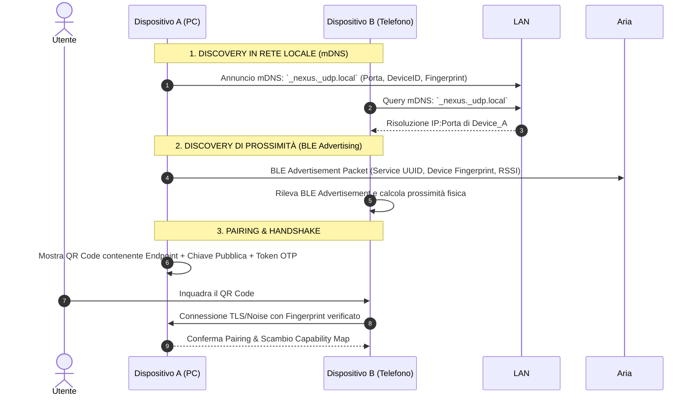

# 01. Discovery & Pairing

Questo documento descrive il processo mediante il quale due dispositivi sulla stessa rete o in prossimità fisica si rilevano a vicenda, stabiliscono la fiducia (*Pairing*) e mantengono la sessione attiva.

---

## 🔍 1. Meccanismi di Discovery

Il sistema utilizza un approccio combinato **mDNS + BLE** per garantire rilevamento istantaneo senza configurazione.



---

## 📡 2. Specifiche del Pacchetto mDNS

Il daemon registra un servizio DNS-SD conforme allo standard RFC 6763:
* **Service Type**: `_nexus._udp.local.` (e fallback `_nexus._tcp.local.`)
* **TXT Records**:
  * `id`: Identificativo univoco del dispositivo (UUIDv4)
  * `name`: Nome leggibile (es. "MacBook Pro di Mario", "Desktop Gaming")
  * `os`: Tipologia OS (`windows` | `macos` | `linux` | `android` | `ios`)
  * `ver`: Versione del protocollo (es. `1.0.0`)
  * `pub`: Hash SHA-256 troncato della chiave pubblica del dispositivo
  * `port`: Porta QUIC/UDP di ascolto

---

## 📶 3. Specifiche del Pacchetto BLE Advertisement

Per consentire il rilevamento istantaneo anche prima della connessione Wi-Fi o quando il display è spento:
* **Custom Service UUID**: `0000FE2B-0000-1000-8000-00805F9B34FB` (Esempio)
* **Manufacturer Specific Data** (24 bytes):
  * `[0..1]`: Company Identifier
  * `[2..17]`: 16-byte Device Identifier
  * `[18..21]`: 4-byte Timestamp rotativo (anti-tracking)
  * `[22]`: Device State Flags (es. `Bit 0`: Media in Playback, `Bit 1`: Headphones connesse)
  * `[23]`: TX Power Level calibrato (utilizzato per la stima accurata della distanza tramite RSSI)

---

## 🤝 4. Flusso di Pairing e Autenticazione (Mutual Trust)

Il pairing deve avvenire una sola volta per coppia di dispositivi.

### Metodo A: Inquadratura QR Code (Consigliato)
1. **Device A** genera un QR Code contenente una stringa JSON compatta formattata in base64:
   ```json
   {
     "id": "d4e8b2a1-...",
     "name": "PC Studio",
     "pubkey": "ed25519_base64...",
     "endpoints": ["192.168.1.150:4242", "[fe80::...]:4242"],
     "otp": "839201"
   }
   ```
2. **Device B** scansiona il QR Code con la fotocamera integrata nell'app.
3. Viene avviato l'handshake Noise. Il token OTP garantisce che la richiesta provenga da chi ha fisicamente visto lo schermo.
4. Le chiavi pubbliche vengono salvate nel Keystore locale sicuro (`DeviceTrustStore`).

### Metodo B: PIN Numerico a 6 Cifre (SAS - Short Authentication String)
Se uno dei due dispositivi non ha fotocamera (es. due PC desktop):
1. Device B seleziona Device A dalla lista dei nodi rilevati via mDNS.
2. Entrambi i dispositivi calcolano il codice numerico condiviso derivato dall'hash della sessione crittografica:
   $$\text{SAS} = \text{HKDF}(\text{SharedSecret}) \pmod{10^6}$$
3. L'utente conferma che il codice numerico a 6 cifre a schermo sia identico su entrambi i dispositivi.

---

## 🔒 5. Gestione della Fiducia e Revoca

Ogni dispositivo mantiene un database SQLite locale (`known_peers`):
* `peer_id`: UUID
* `public_key`: Chiave pubblica Ed25519
* `trust_status`: `AUTHORIZED` | `RESTRICTED` | `BLOCKED`
* `last_seen`: Timestamp
* `allowed_plugins`: Array JSON dei plugin consentiti per questo specifico dispositivo (es. `["media", "files"]` escludendo `["input"]`).
