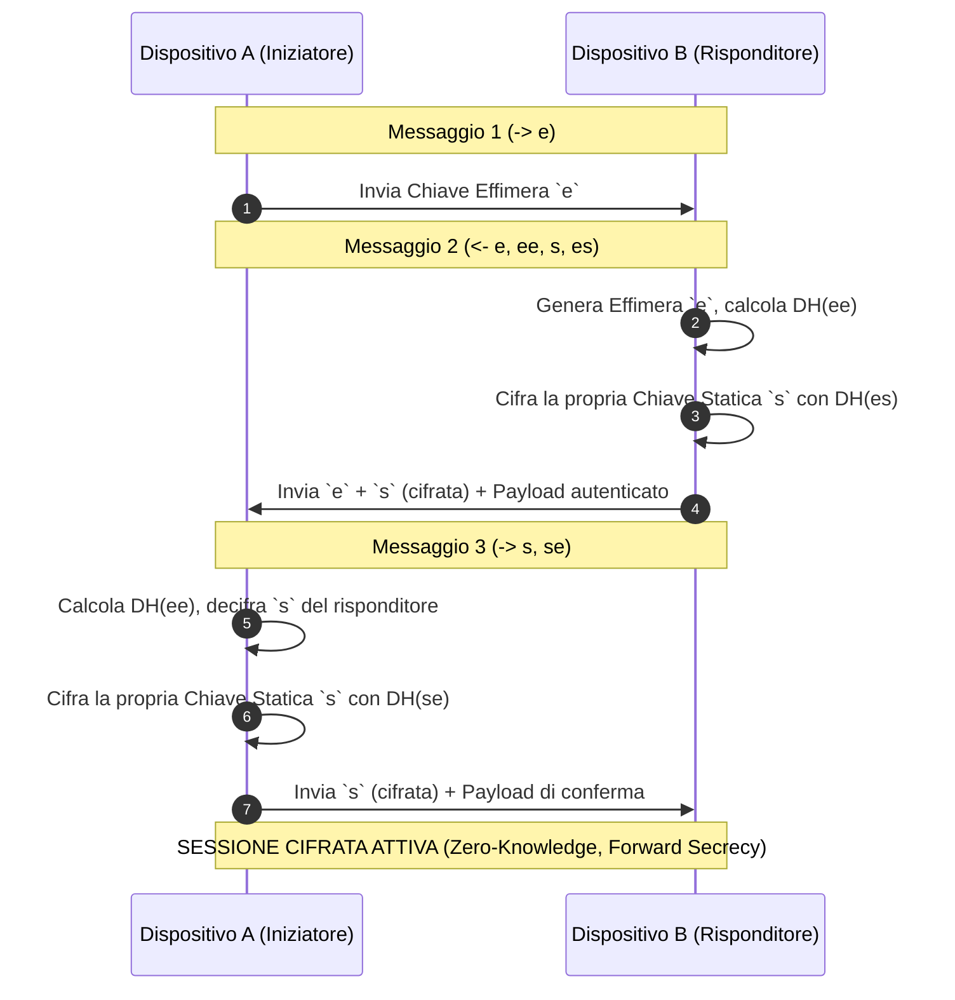

# 03. Crittografia E2EE & Modello dei Permessi

Tutte le comunicazioni tra i dispositivi avvengono su un canale crittografato **End-to-End (E2EE)**. Anche su una rete Wi-Fi pubblica o non protetta (es. università, aeroporto o ufficio), nessun dato sensibile, file, stream audio o contenuto degli appunti può essere intercettato o manomesso.

---

## 🔐 1. Il Noise Protocol Framework

Invece di affidarsi a certificati TLS firmati da CA esterne (inadatti per IP locali dinamici), il sistema implementa il **Noise Protocol Framework** (in particolare il pattern standard **`Noise_XX_25519_ChaChaPoly_BLAKE2s`**), lo stesso utilizzato da WireGuard e Signal.

### Componenti Crittografici:
* **Curve25519 (X25519)**: Scambio di chiavi Diffie-Hellman asimmetrico ad altissima velocità.
* **ChaCha20-Poly1305**: Cifratura simmetrica autenticata (AEAD) con overhead computazionale trascurabile anche su processori mobili a basso consumo.
* **BLAKE2s**: Funzione di hash crittografica ultra-rapida per il calcolo dei digest e della derivazione delle chiavi (HKDF).
* **Ed25519**: Chiavi d'identità persistenti per la firma digitale del dispositivo.

---

## 🔄 2. Flusso dell'Handshake Noise_XX

Il pattern **Noise_XX** consente l'autenticazione reciproca di entrambi i dispositivi senza richiedere una conoscenza preventiva delle chiavi pubbliche (fondamentale al primo accoppiamento):



### Proprietà di Sicurezza Garantite:
1. **Forward Secrecy (PFS)**: La compromissione della chiave statica del dispositivo nel futuro non permette di decifrare le sessioni passate.
2. **Resistenza al Replay**: Ogni messaggio trasporta un contatore (nonce) incrementale a 64-bit; pacchetti duplicati o fuori sequenza vengono scartati immediatamente.
3. **Identity Hiding**: Le chiavi statiche dei dispositivi non viaggiano mai in chiaro sulla rete.

---

## 🛡️ 3. Modello dei Permessi Granulari (Access Control Matrix)

Ogni dispositivo registrato riceve un set di permessi modificabile in qualsiasi momento dall'utente dalla schermata *Settings*:

```
+-------------------------------------------------------------------+
|               PERMESSI PER IL DISPOSITIVO "MacBook Pro"            |
+-------------------------------------------------------------------+
| [X] Sincronizzazione Appunti (Clipboard)                          |
| [X] Continuità Multimediale (Media Handoff)                       |
| [ ] Controllo Remoto Cursore / Tastiera (Input Bridge)            |
| [X] Trasferimento File (Chiedi sempre conferma prima di salvare)  |
| [X] Audio Relay & Streaming Cuffie                                |
| [ ] Accesso Fotocamera Remota (Webcam Bridge)                     |
+-------------------------------------------------------------------+
```

### Validazione nel Core Rust:
Quando arriva una richiesta RPC per un plugin (es. `InputBridge`), il Core Daemon verifica:
1. Che il mittente abbia una sessione crittografica valida.
2. Che il `device_id` mittente sia presente nel `trust_store` locale.
3. Che il permesso specifico `Permission::RemoteInput` sia attivo nel profilo del peer.
4. Se una di queste condizioni fallisce, la richiesta viene scartata e registrata nei log di audit.
