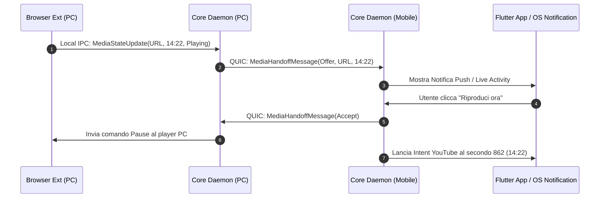

# 01. Media Continuity & Smart Video Handoff

Questo plugin realizza una delle funzionalità cardine dell'ecosistema: **la transizione fluida e istantanea di flussi multimediali (video YouTube, serie streaming o player locali) da un dispositivo all'altro**, conservando il millisecondo esatto di riproduzione.

---

## 🎬 1. Il Caso d'Uso: Come Funziona per l'Utente

1. **Scenario A (Push con notifica)**:
   - Stai guardando un video su YouTube o una lezione su PC desktop al minuto `14:22`.
   - Ti alzi dalla scrivania con lo smartphone in mano.
   - Il daemon rileva la variazione di prossimità (BLE RSSI) o l'assenza di input sul PC: sullo smartphone appare una notifica o una Live Activity:
     > 📺 **Riprendi su YouTube**  
     > *Guarda "Introduzione a Rust" da 14:22*  
     > [ Riproduci ora ] [ Ignora ]
   - Cliccando sul pop-up, lo smartphone apre direttamente l'app YouTube o il browser al minuto `14:22`, mentre il PC mette automaticamente in pausa.

2. **Scenario B (Pull dall'App)**:
   - Apri l'app sullo smartphone o sul tablet: in cima alla schermata principale compare una card interattiva dinamica con thumbnail:
     > 🟢 **In riproduzione su PC Studio**  
     > *YouTube: "Podcast #42" - 35:10 / 1:12:00*  
     > [ ▶️ Trasferisci qui ] [ ⏸️ Pausa remota ]

---

## 🏗️ 2. Architettura di Rilevamento della Riproduzione

Il sistema cattura lo stato dei media attraverso due canali complementari:

```
                  SORGENTI DI RIPRODUZIONE MULTIMEDIALE
                                    │
         ┌──────────────────────────┴──────────────────────────┐
         ▼                                                     ▼
 [1. Browser WebExtension]                             [2. OS Media Sessions]
 - YouTube, Netflix, Twitch, Spotify Web                - Spotify Desktop, VLC, MPV, Apple Music
 - Hook sull'elemento `<video>` / Player API            - Windows SMTC, Linux MPRIS, macOS NowPlaying
         │                                                     │
         └──────────────────────────┬──────────────────────────┘
                                    ▼
                     [Local Media Tracker (Rust Plugin)]
                                    │ (QUIC Broadcast ai Peer)
                                    ▼
                [Mobile Client (Flutter) / Notifica / Intent]
```

### Canale 1: Estensione Browser (WebExtension)
Un'estensione leggera installata su Chrome/Firefox/Edge/Brave monitora i tag HTML5 `<video>` e `<audio>`:
* Estrae: `URL`, `currentTime`, `duration`, `title`, `thumbnail`, `is_paused`.
* Invia gli aggiornamenti al Core Daemon locale ogni volta che lo stato cambia (play, pause, seek) tramite Native Messaging o Local Socket protetto (`127.0.0.1`).

### Canale 2: Integrazione Nativa con le API Multimediali dell'OS
* **Windows**: `Windows.Media.Control.GlobalSystemMediaTransportControlsSessionManager` (SMTC).
* **Linux**: D-Bus interface `org.mpris.MediaPlayer2.*`.
* **macOS**: `MediaRemote` framework / `MRMediaRemoteGetNowPlayingInfo`.

---

## 📲 3. Esecuzione del Handoff sul Dispositivo di Destinazione

Quando l'utente accetta il trasferimento del flusso, il dispositivo ricevente attiva l'azione più appropriata:

| Piattaforma | Tipo di Media | Meccanismo di Apertura |
| :--- | :--- | :--- |
| **Android** | YouTube URL | Android Intent: `vnd.youtube://{video_id}?t={seconds}` |
| **iOS** | YouTube URL | Universal Link: `youtube://watch?v={video_id}&t={seconds}` (con fallback su Safari) |
| **Android/iOS**| Video Web generico | Apertura diretta nel browser predefinito con parametro timestamp `#t={seconds}` |
| **PC (Win/Mac/Lin)** | URL Web | Comando browser nativo (`chrome.exe https://...#t=...` o `open ...`) |
| **Desktop** | File Locale (VLC/MPV) | Se il file è condiviso in rete, avvia `vlc --start-time={seconds} "{file_path}"` |

---

## ⚡ 4. Protocollo di Negoziazione Handoff


