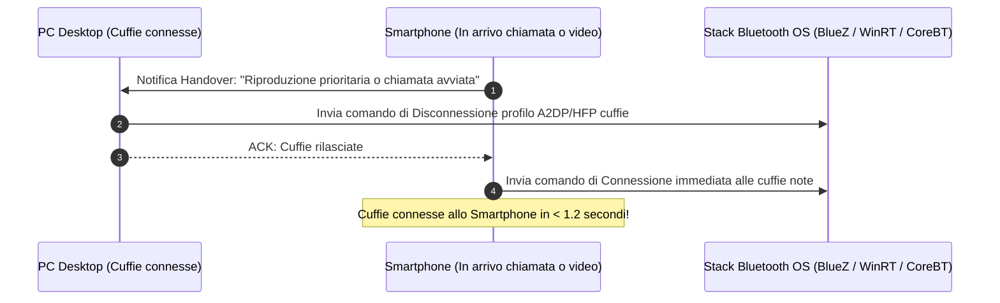

# 02. Audio Relay a Bassa Latenza & Smart Bluetooth Switcher

Questo plugin risolve due dei problemi più sentiti dagli utenti multipiattaforma:
1. **Private Listening (Audio Forwarding)**: Guardare un film o giocare sul monitor del PC mentre l'audio viene riprodotto nelle cuffie collegate allo smartphone (o viceversa), senza disturbare chi è nella stanza.
2. **Smart Bluetooth Switching**: Gestire il passaggio intelligente degli auricolari Bluetooth standard tra PC e smartphone senza bisogno di chip proprietari (come Apple H1/H2 o Google Fast Pair).

---

## 🎧 1. Architettura Audio ad Altissime Prestazioni (<18ms Latenza)

Per raggiungere una latenza impercettibile per il labiale video e il gaming, il motore audio adotta un'architettura **Lock-Free RingBuffer** ispirata ai driver audio professionali (ASIO, Scream e PipeWire):

---

## ⚙️ 2. Breakdown Dettagliato della Latenza End-to-End

| Fase della Pipeline Audio | Componente Tecnologico | Tempo di Elaborazione |
| :--- | :--- | :--- |
| **1. Cattura Audio Sistema** | WASAPI Loopback (Win) / PipeWire (Linux) / ScreenCaptureKit (Mac) | **3 – 5 ms** |
| **2. Codifica Opus** | `OPUS_APPLICATION_RESTRICTED_LOWDELAY` (Frame 5ms, 128 kbps) | **2 – 3 ms** |
| **3. Trasmissione di Rete** | Wi-Fi 5/6 GHz LAN (QUIC Unreliable Datagrams) | **1 – 4 ms** |
| **4. Jitter Buffer Adattivo** | Buffer dinamico calibrato su deviazione standard del jitter ($\sigma_{\text{jitter}}$) | **5 – 8 ms** |
| **5. Decodifica & Resampling** | Opus Decoder + Resampling per compensazione drift di clock | **1 – 2 ms** |
| **6. Output Hardware Mobile** | Android AAudio Burst (96-192 campioni) / iOS CoreAudio | **3 – 5 ms** |
| **TOTALE END-TO-END** | **Flusso continuo PC -> Smartphone** | **15 – 27 ms** |

> 🎯 **Risultato**: Sotto i 40ms l'orecchio umano e il cervello percepiscono l'audio come perfettamente sincronizzato con il labiale del video (lip-sync broadcast standard).

---

## 🛠️ 3. Compensazione del Clock Drift & Gestione Perdita Pacchetti

* **Clock Drift Resampling**: Le schede madri del PC e dello smartphone hanno oscillatori al quarzo leggermente sfasati (differenza di pochi millisecondi ogni minuto). Il plugin adatta dinamicamente il sample rate di riproduzione tramite micro-interpolazione, evitando click, pop o accumulo di ritardo nel tempo.
* **Opus Packet Loss Concealment (PLC) & FEC**: Se un pacchetto UDP viene perso per un'interferenza Wi-Fi, il decoder Opus ricostruisce la forma d'onda mancante senza interruzioni udibili.

---

## 🔁 4. Modalità Audio Inverso (Reverse Audio Streaming)

* Se possiedi un impianto stereo Hi-Fi collegato al PC, puoi inviare l'audio del tuo smartphone (Spotify, note vocali, YouTube Music) direttamente alle casse del PC con un solo tap, con qualità audiophile lossless-perceptual (192 kbps Opus stereo).

---

## 🔀 5. Smart Bluetooth Switching Software

Gli auricolari Apple passano da un Mac a un iPhone solo grazie a chip proprietari. Con il nostro sistema, **qualsiasi paio di cuffie Bluetooth (Sony, Bose, Jabra, Sennheiser, Samsung Galaxy Buds)** beneficia dello switch automatico coordinato:

