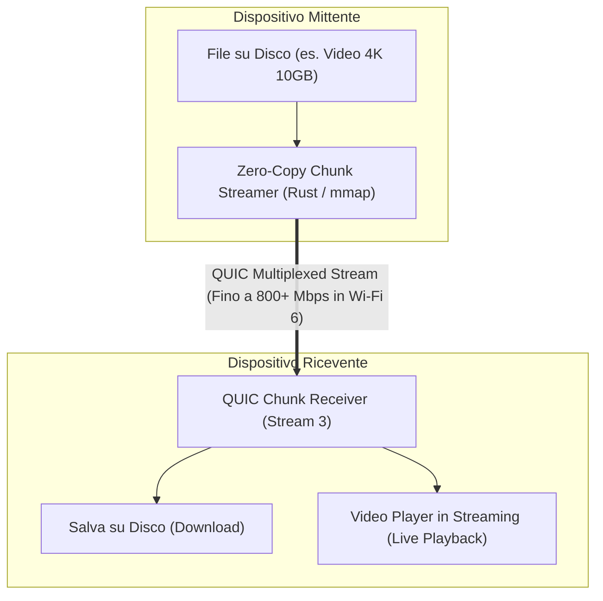

# 04. Smart Clipboard & Streaming File Transfer

Questo documento definisce il funzionamento dei plugin di sincronizzazione degli appunti e del trasferimento file ad alte prestazioni.

---

## 📋 1. Smart Clipboard Engine

A differenza del semplice copia/incolla di testo, il nostro motore di clipboard è **intelligente, reattivo e protetto da crittografia E2EE**.

### Funzionalità Chiave:
1. **Supporto Multiformato**: Testo semplice, HTML formattato, immagini (PNG/JPEG) e URI di file.
2. **Prevenzione dei Loop Infiniti**: Il daemon calcola l'hash SHA-256 di ogni elemento copiato. Se il contenuto proviene già da un peer remoto, non viene ritrasmesso in rete.
3. **Smart Parser & Action Chips**:
   Quando copi un testo, l'app analizza localmente il contenuto ed estrae azioni contestuali:
   - **Codice OTP / 2FA**: Mostra un pop-up rapido *"Incolla codice 849201 su PC"* con scadenza dopo 30 secondi.
   - **Indirizzo URL**: Offre il tasto *"Apri nel browser del PC"*.
   - **Colore HEX / RGB (`#FF5733`)**: Mostra l'anteprima visiva del colore con opzione di copia nei vari formati (CSS, Flutter, Android).
   - **Numero di Telefono**: Opzione *"Chiama da smartphone"*.
4. **Cronologia Protetta (Opzionale)**: Cronologia locale cifrata con ricerca rapida, con esclusione automatica dei password manager (tramite flag standard `ExcludeClipboardContentFromMonitorProcessing`).

---

## 📁 2. Streaming & Chunked File Transfer

Il trasferimento file è progettato per saturare la banda Wi-Fi 6 / LAN Gigabit senza saturare la RAM, con supporto sia al download che allo **streaming istantaneo senza copia preventiva**.

### Caratteristiche del Trasferimento File:
* **Zero-Copy & Memory Mapped I/O (`mmap`)**: I file giganti non vengono caricati in memoria, ma letti a blocchi (*chunk*) da 64 KB a 1 MB direttamente dalla cache del disco del kernel.
* **Ripresa Automatica (Resumable Transfers)**: Se la connessione Wi-Fi si interrompe per qualche secondo, il trasferimento riprende dall'ultimo byte confermato senza ricominciare da capo.
* **Drag-and-Drop Globale**: Trascina un file sopra la finestra dell'app o sull'icona della tray bar per inviarlo istantaneamente a uno qualsiasi dei dispositivi vicini.
