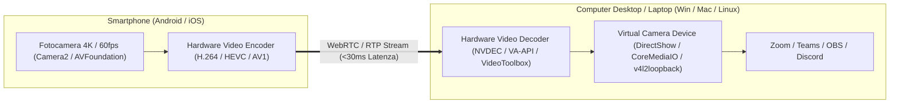

# 05. Sensor Bridge & Continuity Camera

Questo plugin consente di utilizzare i sensori avanzati dello smartphone (fotocamere 4K, microfoni multipli con cancellazione del rumore, sensori di movimento) come periferiche virtuali native per qualsiasi PC (Windows, Linux, macOS).

---

## 📷 1. Universal Continuity Camera (Webcam 4K Senza Fili)

La qualità delle fotocamere degli smartphone moderni supera di gran lunga qualsiasi webcam integrata nei laptop. Il nostro sistema trasforma lo smartphone in una webcam professionale a bassissima latenza per Zoom, Google Meet, Teams, OBS e Discord.

---

## ✨ 2. Funzionalità Avanzate della Fotocamera

* **Center Stage (Inquadratura Automatica)**: Riconoscimento del volto locale on-device per ritagliare ed eseguire il pan dello stream video seguendo i movimenti della persona.
* **Desk View (Visuale Scrivania)**: Utilizzo della lente grandangolare (Ultra-Wide) con correzione prospettica per mostrare sia il volto che la superficie del tavolo durante lezioni o recensioni di oggetti.
* **Studio Light & Regolazioni Manuali**: Esposizione, bilanciamento del bianco, ISO e flash dello smartphone regolabili direttamente dal pannello di controllo su PC.

---

## 🎙️ 3. Microfono Wireless ad Alta Fedeltà

Oltre al video, il microfono dello smartphone (spesso dotato di cancellazione attiva del rumore a più capsule) può essere instradato come **periferica microfono virtuale** per il computer, offrendo una qualità vocale da podcast senza dover acquistare microfoni esterni.
