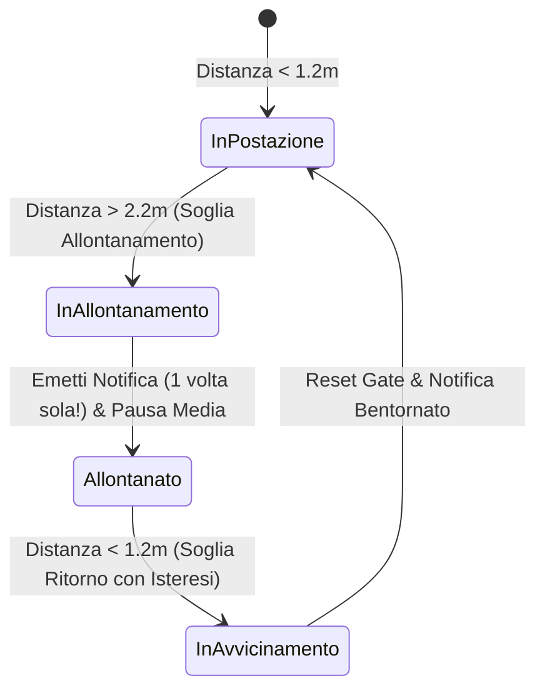

> Stato aggiornato: [revisione operativa](../2026-09-10-proximity-input-review.md).
> La descrizione seguente è una specifica storica, non una garanzia implementativa:
> BLE RSSI non garantisce precisione né assenza di falsi positivi; blocco oggi OFF
> salvo consenso locale, peer scelto e calibrato, soglia e conferma temporale.
> Sblocco biometrico e precisione delle distanze non sono funzionalità verificate.

# 06. Proximity Detection & Auto-Lock (BLE RSSI)

Questo plugin sfrutta le emissioni periodiche di pacchetti Bluetooth Low Energy (BLE) per stimare con precisione la distanza fisica dell'utente rispetto alla propria postazione di lavoro, attivando automazioni contestuali intelligenti.

---

## 📐 1. Algoritmo di Stima della Distanza (Kalman Filtered RSSI)

I valori grezzi di RSSI (Received Signal Strength Indicator) sono soggetti a fluttuazioni dovute a riflessioni e ostacoli fisici. Il daemon applica un **Filtro di Kalman a 1D** sui campioni BLE per ottenere una stima stabile e priva di falsi positivi:

```math
\text{Distanza (metri)} \approx 10^{\frac{\text{Measured Power} - \text{RSSI}_{\text{filtrato}}}{10 \cdot N}}
```
*(dove $N$ è l'esponente di attenuazione ambientale, calibrato a $2.0 - 2.5$).*

---

## 🏃 2. Automazioni di "Allontanamento" (Walk-Away Triggers)

Quando l'utente si allontana con lo smartphone (es. distanza stimata $> 4\text{ metri}$ o perdita del segnale per oltre 15 secondi):

1. **Auto-Lock della Postazione di Lavoro**:
   - Esegue il blocco della sessione di sistema (`LockWorkStation()` su Windows, `loginctl lock-session` su Linux, `SACLockScreenImmediate()` su macOS).
2. **Media Auto-Pause & Handoff Prompt**:
   - Mette in pausa qualsiasi video o canzone in riproduzione sul computer.
   - Invia una notifica ad alta priorità sullo smartphone per riprendere la riproduzione in mobilità.
3. **Muting Altoparlanti PC**:
   - Riduce a zero il volume degli altoparlanti per evitare notifiche rumorose nella stanza vuota.

---

## 🚶‍♂️ 3. Automazioni di "Avvicinamento" (Approach Triggers)

Quando l'utente ritorna verso la scrivania (distanza stimata $< 1.5\text{ metri}$):

1. **Wake Display**: Risveglio automatico dei monitor PC dalla sospensione.
2. **One-Tap Biometric Unlock**:
   - Sullo smartphone appare una notifica con prompt biometrico (Impronta o Face ID).
   - Confermando sul telefono, il PC si sblocca istantaneamente senza dover digitare la password lunga sulla tastiera.
3. **Pre-Riscaldamento Connessione P2P**: La sessione QUIC viene ripristinata in anticipo per essere pronta a ricevere file, input o comandi.

---

## 🔒 4. Macchina a Stati Isteretica & Gate "Single-Fire" (Anti-Spam)

Per evitare notifiche ripetute a ogni passo compiuto dall'utente, il motore di prossimità adotta una macchina a stati con isteresi asimmetrica:



1. **Gate "Single-Fire" (`_hasFiredDepartureAlert`)**:
   - Quando l'utente supera la soglia di allontanamento ($2.2\text{m}$), l'avviso scatta **esattamente una volta**.
   - Eventuali fluttuazioni successive o passi ulteriori a $2.5\text{m}, 3.0\text{m}, 4.0\text{m}$ non generano alcun duplicato né ulteriori popup.
2. **Isteresi e Reset al Rientro**:
   - Lo stato di allontanamento viene resettato **esclusivamente** quando la distanza scende sotto la soglia di ritorno ($1.2\text{m}$).
   - Al rientro, viene emesso l'avviso di bentornato ed il gate viene riarmato per il prossimo ciclo di allontanamento.

