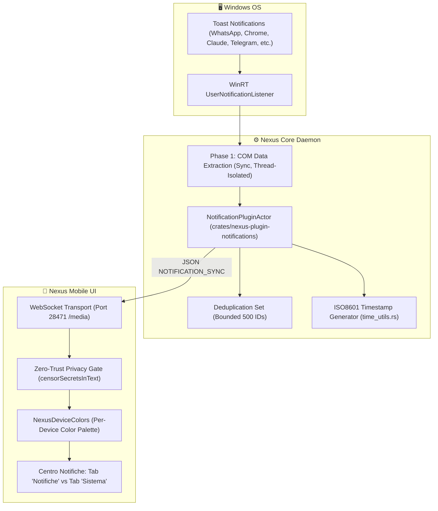

# 07. Notification Sync, Mirroring & Zero-Trust Privacy Gate

Il plugin `nexus-plugin-notifications` gestisce l'intercettazione in tempo reale delle notifiche emesse dal sistema operativo desktop (Windows Toast Notifications), il loro filtraggio, la sanitizzazione privacy, l'instradamento via WebSocket verso i client mobili connessi e la visualizzazione differenziata per dispositivo.

---

## 🔔 1. Architettura di Cattura Nativa (Windows WinRT)

Il daemon integra un listener asincrono nativo basato sulle API WinRT (`windows::UI::Notifications::Management::UserNotificationListener`).



### Separazione COM vs Tokio Async
Gli oggetti COM WinRT non implementano il trait `Send` di Rust. Per prevenire deadlock e violazioni di thread-safety:
1. **Fase 1 (Sincrona)**: Le notifiche vengono lette e mappate in strutture Rust primitive (`u32`, `String`). Tutti gli oggetti COM vengono rilasciati immediatamente.
2. **Fase 2 (Asincrona)**: I dati estratti vengono filtrati tramite cache di deduplicazione, formattati in JSON e inviati sui canali Tokio `mpsc` dei client WebSocket connessi.

---

## 🛡️ 2. Categorizzazione e Zero-Trust Privacy Gate

### A. Categorie di Notifiche (`NexusNotificationCategory`)
Le notifiche sono rigidamente separate in due flussi indipendenti:
1. **`osNotification`**: Notifiche reali generate dalle applicazioni esterne del sistema operativo (WhatsApp, browser, client AI, email).
2. **`internalApp`**: Avvisi interni di sistema dell'ecosistema Nexus (Allontanamento rilevato, Bentornato alla postazione, Handoff video/audio).

Nel Centro Notifiche mobile, le notifiche interne di sistema non inquinano la lista principale delle notifiche OS, ma risiedono nella tab dedicata **Sistema**.

### B. Sanitizzazione Automatica Token e Segreti
All'arrivo di ogni notifica, il modulo `censorSecretsInText` analizza il contenuto e maschera selettivamente:
- Chiavi private (PEM / RSA / EC).
- Token API e credenziali (Bearer, OpenAI `sk-...`, GitHub `ghp-...`, JWT).
- Coordinate bancarie (IBAN).
- Codici fiscali e identificativi PII.
- Numeri di carte di credito.
- Codici 2FA / OTP temporanei.

Il testo circostante viene preservato, permettendo all'utente di comprendere il contesto della notifica senza esporre segreti sulla lockscreen o a vista.

---

## 🎨 3. Sistema di Colori per Dispositivo (`NexusDeviceColors`)

Per consentire l'identificazione immediata a colpo d'occhio della provenienza di ciascuna notifica:
- **PC Desktop / Windows Principale**: Indigo (`#6366F1`)
- **Smartphone Android / Mobile**: Smeraldo (`#10B981`)
- **Dispositivi Aggiuntivi**: Ambra (`#F59E0B`), Rosa (`#F43F5E`), Ciano (`#06B6D4`), Viola (`#8B5CF6`).

Ogni card notifica presenta un **bordo solido laterale sinistro di 4px** colorato con la tinta assegnata al dispositivo mittente, sincronizzato con i chip di filtro e gli indicatori di stato.

---

## 📡 4. Contratto del Messaggio WebSocket (`NOTIFICATION_SYNC`)

```json
{
  "type": "NOTIFICATION_SYNC",
  "id": "win-notif-10482",
  "title": "Claude",
  "body": "Il task di compilazione è completato con successo.",
  "app_name": "Claude",
  "sender_device": "PC Windows (Nexus Core)",
  "sender_device_id": "00000000-0000-0000-0000-000000000001",
  "timestamp": "2026-09-09T12:00:00.000Z",
  "has_secret": false,
  "secret_category": "",
  "category": "osNotification"
}
```
